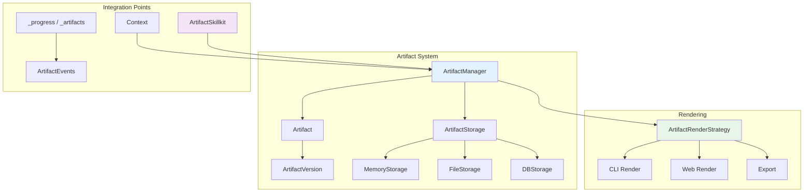

# Dolphin Language SDK - Artifacts 功能设计方案

> 📅 创建日期: 2025-12-11  
> 📝 状态: 设计讨论阶段

## 1. 概述

### 1.1 什么是 Artifacts

在 AI 对话场景中，**Artifacts（工件）** 指的是对话过程中生成的、独立于对话文本的结构化产物。Artifacts 的核心特点是：**可独立渲染**、**可版本化**、**可导出**、**可继续编辑**。

> 本文把 Artifact 定位为**对话外的可交互对象**。其对外契约需要可演进：未来新增类型/渲染器/存储形态时，应尽量不要求修改核心枚举或上层 App 主流程（最多做增量支持）。

### 1.2 常见 Artifact 类型

| 类型 | 示例 |
|------|------|
| **代码 (Code)** | Python 脚本、React 组件、SQL 查询 |
| **文档 (Document)** | Markdown 文档、报告、计划 |
| **可视化 (Visualization)** | SVG 图表、Mermaid 图、数据可视化 |
| **文件 (File)** | 生成的 CSV、JSON、配置文件 |
| **交互式内容 (Interactive)** | HTML 页面、小应用 |

### 1.3 设计目标

- 为 Dolphin Language SDK 添加原生的 Artifacts 支持
- 与现有的 Skillkit、Context、Agent 架构无缝集成
- **与现有 `_progress` 机制向后兼容**，支持现有前端应用渐进式迁移
- 支持 CLI 和 Web 两种渲染模式，通过渲染策略层解耦
- 提供版本管理和持久化能力
- **类型可扩展**：新增/自定义 artifact 类型不要求修改核心枚举；旧端可兜底展示，新端可按需增强渲染

### 1.4 设计原则

| 原则 | 说明 |
|------|------|
| **向后兼容** | 现有前端无需改动即可继续工作，新功能通过扩展实现 |
| **渐进式采用** | 前端可以分阶段支持 artifact 功能（列表 → 事件 → 渲染） |
| **渲染分离** | Core SDK 产生结构化数据，渲染逻辑由各端自行实现 |
| **复用变量池** | Artifact 事件通过 `_progress` 传递，复用现有订阅机制 |
| **契约可演进** | 所有对外结构包含 `schema_version`；未知字段/未知类型必须有降级策略 |

---

## 2. 现有框架基础设施分析

当前框架中已有一些可复用的组件：

| 已有组件 | 位置 | 可复用点 |
|----------|------|----------|
| `SkillkitHook` | `skill_results/skillkit_hook.py` | 结果处理钩子，支持 `get_for_llm` / `get_for_app` 分离 |
| `ResultReference` | `skill_results/result_reference.py` | 结果引用系统，支持缓存和元数据 |
| `CacheBackend` | `skill_results/cache_backend.py` | 缓存后端抽象，支持多种持久化方式 |
| `StrategyRegistry` | `skill_results/strategy_registry.py` | 策略模式，支持不同格式转换 |
| `Context` | `context.py` | 变量池、Agent 管理、消息历史 |
| `AgentEvent` | `agent/base_agent.py` | 事件监听系统 |
| **`ProgressInstance`** | `runtime/runtime_instance.py` | **前端交互核心：Stage 事件流、`_progress` 变量** |
| **`StageInstance`** | `runtime/runtime_instance.py` | **可扩展的事件类型（TypeStage 枚举）** |

### 2.1 可复用的设计模式

1. **策略模式** - `StrategyRegistry` 可扩展用于 Artifact 渲染策略
2. **钩子模式** - `SkillkitHook` 的 `on_tool_after_execute` 模式可用于 Artifact 创建/更新时机
3. **引用模式** - `ResultReference` 的引用 ID 机制可复用于 Artifact 引用
4. **变量池订阅** - `_progress` 变量通过 `arun(stream_variables=True)` 传递给前端，是**前端集成的核心机制**

---

## 3. 架构设计

### 3.1 整体架构图



### 3.2 模块结构

```
src/DolphinLanguageSDK/
├── artifacts/                      # 新增模块
│   ├── __init__.py
│   ├── models.py                   # Artifact 数据模型
│   ├── manager.py                  # ArtifactManager
│   ├── storage/                    # 存储后端
│   │   ├── __init__.py
│   │   ├── base.py                 # 存储抽象基类
│   │   ├── memory.py               # 内存存储
│   │   └── file.py                 # 文件存储
│   ├── strategies.py               # 渲染策略
│   └── exceptions.py               # 异常定义
├── skill/
│   └── installed/
│       └── artifact_skillkit.py    # Artifact 操作技能集（新增）
└── context.py                      # 扩展支持 ArtifactManager
```

### 3.3 前端集成与 `_progress` 兼容性设计

> ⚠️ **关键设计约束**：现有前端应用通过 `_progress` 变量的 stage 信息与 Dolphin SDK 交互。Artifacts 系统必须与这一机制保持兼容，支持渐进式迁移。

#### 3.3.1 现有数据流

```
┌─────────────────────────────────────────────────────────────┐
│                     Core SDK                                 │
│  ExploreBlock → ProgressInstance → set_variable("_progress") │
└────────────────────────────┬────────────────────────────────┘
                             │ 变量池订阅  
                             ▼
┌─────────────────────────────────────────────────────────────┐
│              arun(stream_variables=True)                    │
│              ↓                                               │
│          前端接收 _progress: List[Stage]                     │
└─────────────────────────────────────────────────────────────┘
```

**现有 Stage 结构 (`StageInstance.get_triditional_dict()`)：**
```python
{
    "id": "uuid",
    "stage": "llm" | "skill" | "assign",
    "agent_name": "...",
    "answer": "...",
    "think": "...",
    "status": "processing" | "completed" | "failed",
    "skill_info": {...},
    "block_answer": "...",
    # ... 其他字段
}
```

#### 3.3.2 扩展后的数据流（向后兼容）

```
┌─────────────────────────────────────────────────────────────┐
│                     Core SDK                                 │
│                                                              │
│  ExploreBlock → ProgressInstance → _progress (stages)       │
│                          ↓                                   │
│  ArtifactManager → sync_artifacts_variable() → _artifacts   │
│                          ↓                                   │
│  ArtifactSkillkit → (返回 artifact_event) → _progress        │
└────────────────────────────┬────────────────────────────────┘
                             │ 变量池订阅（复用现有机制）
                             ▼
┌─────────────────────────────────────────────────────────────┐
│              arun(stream_variables=True)                    │
│              ↓                                               │
│          前端接收:                                           │
│            - _progress: List[Stage]  (可选：从 skill 返回体识别 artifact_event) │
│            - _artifacts: List[ArtifactSummary]  (NEW!)      │
└─────────────────────────────────────────────────────────────┘
```

#### 3.3.3 Artifact 事件如何进入 `_progress`（推荐：最小侵入式）

为避免修改 `TypeStage` 枚举并波及 recorder/runtime_graph/前端解析，推荐**复用既有 `stage="skill"`**：

```python
# 约定：当 skill 返回体包含 artifact_event 字段时，表示一次 artifact 事件
# 事件将作为该 skill stage 的 answer（dict）被序列化进入 _progress
{
  "stage": "skill",
  "status": "completed",
  "skill_info": {"name": "_artifact_create", "...": "..."},
  "answer": {
    "artifact_event": {
      "action": "create",               # create | update | delete | export
      "artifact_id": "artifact-uuid",
      "version": 1,
      "summary": { ... ArtifactSummary ... }
    }
  }
}
```

> 这样做的好处：旧前端完全不需要识别新 `stage`；新前端只需在既有 `_progress` 处理链路里增量识别 `answer.artifact_event`。

#### 3.3.4 可选增强：新增单一 `TypeStage.ARTIFACT`（非必须）

如确有强需求要在 `_progress[*].stage` 层面表达 artifact（例如统一的渲染分发），建议只新增一个枚举值：

- `TypeStage.ARTIFACT = "artifact"`
- 具体动作放在 payload：`action=create/update/delete/export`

这比为每个动作新增 `ARTIFACT_*` 枚举更利于未来扩展（减少“枚举爆炸”）。

#### 3.3.5 `_artifacts` 变量结构

Context 中新增 `_artifacts` 变量，包含所有 Artifact 的**摘要列表**（默认不包含全文内容，以避免流式变量快照过大）：

```python
# 通过变量池订阅获取：variables._artifacts
[
    {
        "id": "artifact-uuid",
        "schema_version": 1,
        "type": "code.python",          # 推荐：可命名空间/可分层的字符串类型（见 4.1）
        "title": "数据分析脚本",
        "language": "python",           # 可选（仅部分类型需要）
        "version": 2,
        "media_type": "text/x-python",  # 可选（MIME）
        "content_preview": "import pandas as pd\n...",  # 预览（默认 200 字符）
        "content_ref": "result_ref_id", # 指向缓存/存储中的全文（推荐复用 skill_results）
        "size_bytes": 12345,            # 可选：用于 UI 决策/提示
        "created_at": "2025-12-13T10:00:00",
        "updated_at": "2025-12-13T10:05:00",
        "render_hint": {"renderer": "code-editor", "options": {"language": "python"}},  # 可选
    },
    # ... 更多 artifacts
]
```

> 说明：`_artifacts` 作为“索引/目录”非常稳定；未来新增类型只要给出 `type/media_type/render_hint`，旧前端也能用兜底渲染（raw/下载/提示不支持）。

> 建议区分两种数据形态：
> - `ArtifactSummary`：来自 `_artifacts`，用于列表/导航（轻量）
> - `ArtifactDetail`：通过 `_artifact_get` 拉取，包含 `content`（用于编辑/预览）

#### 3.3.6 前端适配指南

**最小改动（仅支持 artifact 列表）：**

```typescript
function handleVariables(variables: Record<string, any>) {
    // 现有逻辑不变
    if (variables._progress) {
        updateProgressUI(variables._progress);
    }
    
    // 新增：artifact 列表支持
    if (variables._artifacts) {
        setArtifactList(variables._artifacts);
    }
}
```

**完整支持（实时 artifact 事件）：**

```typescript
function handleProgress(stages: Stage[]) {
    for (const stage of stages) {
        // 推荐：不依赖新增 stage 枚举，直接识别 skill 返回体里的 artifact_event
        const evt = (stage as any)?.answer?.artifact_event;
        if (evt) {
            onArtifactEvent(evt);
            continue;
        }
        updateConversationFlow(stage);
    }
}
```

#### 3.3.7 渲染分离设计

为了让 CLI 和 Web 前端都能复用渲染逻辑，引入渲染策略层：

```
┌─────────────────────────────────────────────────────────────┐
│                     Core SDK                                 │
│               (产生结构化事件/数据)                          │
└────────────────────────────┬────────────────────────────────┘
                             │ _progress / _artifacts
                             ▼
┌─────────────────────────────────────────────────────────────┐
│              Render Strategy Layer                          │
│                                                              │
│  ArtifactRenderStrategy.for_cli(artifact)  → 终端格式字符串 │
│  ArtifactRenderStrategy.for_web(artifact)  → JSON 渲染配置  │
│  StageRenderStrategy.for_cli(stage)        → 终端 UI 组件   │
│  StageRenderStrategy.for_web(stage)        → React 组件配置 │
└────────────────┬───────────────────────┬────────────────────┘
                 │                       │
                 ▼                       ▼
┌────────────────────────┐   ┌────────────────────────────────┐
│    CLI (Rich)          │   │       Web Frontend             │
│  console_ui.py         │   │  ArtifactPanel.tsx             │
│  stream_renderer.py    │   │  ConversationFlow.tsx          │
└────────────────────────┘   └────────────────────────────────┘
```

#### 3.3.8 迁移路径

| 阶段 | 任务 | 前端改动 | 向后兼容 |
|------|------|---------|---------|
| **Phase 0** | 定义 `ArtifactSummary` / `artifact_event` 契约（不改 `TypeStage`） | 无 | ✅ |
| **Phase 1** | 实现 `_artifacts` 摘要变量同步 | 可选订阅 | ✅ |
| **Phase 2** | ArtifactSkillkit 返回 `artifact_event`（作为 `stage="skill"` 的 answer） | 识别 `answer.artifact_event` | ✅ |
| **Phase 3** | 实现 `ArtifactRenderStrategy` + 类型注册/兜底渲染 | 按需使用 | ✅ |
| **Phase 4** | CLI 支持 artifact 渲染 | N/A | ✅ |
| **Phase 5** | 完善 Web 渲染配置 | 使用渲染配置 | ✅ |
| **Optional** | 新增单一 `TypeStage.ARTIFACT`（若确需在 stage 层面表达） | 识别新 stage 类型 | ✅ |

#### 3.3.9 CLI 优先：不影响非 CLI 的接入方式（推荐落地形态）

目标：先让 CLI 基于 Artifacts 做“美化与互动”，同时**不改变**非 CLI（Web/API/脚本）既有的 `_progress` 订阅与解析方式。

设计约束与策略：

1. **不破坏 `_progress` 契约**
   - `_progress[*].stage` 仍保持 `llm|skill|assign`
   - `_progress[*].status` 仍保持 `processing|completed|failed`
   - 旧端只要继续按现有逻辑渲染 `_progress`，无需为 artifacts 改代码

2. **CLI 只做增量消费**
   - CLI 额外订阅 `_artifacts`（`ArtifactSummary` 列表）用于展示“目录/列表/导航”
   - CLI 识别 `_progress[*].answer.artifact_event` 用于实时交互（提示/弹出面板/高亮）
   - 需要全文时调用 `_artifact_get` / `_artifact_export` 按需拉取，不把全文塞进流式变量

3. **未知类型兜底**
   - CLI：未知 `type` 至少展示标题/类型/版本/更新时间，并提供“导出/查看原始内容”的兜底入口
   - 非 CLI：可继续忽略 artifacts，不影响主对话流

4. **可选的“全面调整”留到第二步**
   - 如果未来需要把 artifact 变成一级 stage（`TypeStage.ARTIFACT`）或引入独立事件总线，再做跨层改造；第一步不做这些重改动

---

## 4. 核心组件设计

### 4.1 Artifact 数据模型

#### 4.1.1 类型扩展性（核心契约）

- `type` 使用**字符串**（而非封闭 Enum），以支持插件/业务自定义类型而无需修改核心代码。
- 命名建议：`<domain>.<kind>[.<subkind>]`
  - 内置示例：`code.python`、`code.javascript`、`doc.markdown`、`diagram.mermaid`、`image.svg`、`doc.html`、`data.json`、`data.table`、`ui.react`
  - 自定义示例：`acme.workflow.v1`、`company.report.weekly`
- 额外提供 `media_type`（MIME）作为渲染/导出兜底：即使 `type` 未被识别，也能选择合理的处理方式（raw/下载/提示不支持）。
- 所有对外结构携带 `schema_version`，未来扩字段只增不删，旧端忽略未知字段即可。

#### 4.1.2 内容引用与流式变量解耦（性能关键）

在 `arun(stream_variables=True)` 模式下，变量会被频繁快照输出。为避免 `_artifacts` 里携带大文本导致性能/带宽问题：

- `_artifacts` 只放 `ArtifactSummary`（含 `content_preview` + `content_ref`），默认不放全文
- 全文通过 `_artifact_get` / `_artifact_export` 按需获取
- `content_ref` 推荐复用现有 `skill_results` 缓存（`ResultReference.reference_id`）

```python
# src/DolphinLanguageSDK/artifacts/models.py
from dataclasses import dataclass, field
from typing import Dict, Any, Optional, List
from datetime import datetime
import uuid


@dataclass
class ArtifactVersion:
    """Artifact 版本快照"""
    version: int
    # 指向全文内容的引用（推荐：ResultReference.reference_id）
    content_ref: str
    updated_at: datetime
    change_summary: str = ""


@dataclass
class Artifact:
    """Artifact 实体"""
    id: str = field(default_factory=lambda: str(uuid.uuid4()))
    schema_version: int = 1
    type: str = "doc.markdown"
    title: str = ""
    language: Optional[str] = None  # 代码语言（如 python, javascript）
    media_type: Optional[str] = None  # MIME，可用于导出/兜底渲染
    version: int = 1
    metadata: Dict[str, Any] = field(default_factory=dict)
    created_at: datetime = field(default_factory=datetime.now)
    updated_at: datetime = field(default_factory=datetime.now)
    
    # 版本历史
    history: List[ArtifactVersion] = field(default_factory=list)

    # 当前版本内容引用（全文不直接挂在对象上，以免变量流/序列化膨胀）
    content_ref: str = ""
    
    def update(self, content_ref: str, title: Optional[str] = None,
               change_summary: str = "") -> "Artifact":
        """更新 Artifact 并保存版本历史"""
        # 保存当前版本到历史
        self.history.append(ArtifactVersion(
            version=self.version,
            content_ref=self.content_ref,
            updated_at=self.updated_at,
            change_summary=change_summary
        ))
        # 更新内容
        self.content_ref = content_ref
        if title:
            self.title = title
        self.version += 1
        self.updated_at = datetime.now()
        return self
    
    def rollback(self, target_version: int) -> "Artifact":
        """回滚到指定版本"""
        for hist in self.history:
            if hist.version == target_version:
                return self.update(
                    content_ref=hist.content_ref,
                    change_summary=f"Rollback to version {target_version}"
                )
        raise ValueError(f"Version {target_version} not found in history")
    
    def to_dict(self) -> Dict[str, Any]:
        """序列化为字典"""
        return {
            "id": self.id,
            "schema_version": self.schema_version,
            "type": self.type,
            "title": self.title,
            "language": self.language,
            "media_type": self.media_type,
            "version": self.version,
            "content_ref": self.content_ref,
            "metadata": self.metadata,
            "created_at": self.created_at.isoformat(),
            "updated_at": self.updated_at.isoformat(),
        }
    
    @classmethod
    def from_dict(cls, data: Dict[str, Any]) -> "Artifact":
        """从字典反序列化"""
        return cls(
            id=data["id"],
            schema_version=data.get("schema_version", 1),
            type=data["type"],
            title=data["title"],
            language=data.get("language"),
            media_type=data.get("media_type"),
            version=data["version"],
            content_ref=data.get("content_ref", ""),
            metadata=data.get("metadata", {}),
            created_at=datetime.fromisoformat(data["created_at"]),
            updated_at=datetime.fromisoformat(data["updated_at"]),
        )
```

### 4.2 Artifact Manager

ArtifactManager 建议拆成两层关注点，便于未来扩展与替换：

- **元数据层**：Artifact/版本号/标题/类型/时间戳等（小对象，适合进 `_artifacts` 摘要）
- **内容层**：正文/二进制/大文本（通过 `content_ref` 引用；实现可用文件、DB、对象存储、或复用现有 `CacheBackend`）

```python
# src/DolphinLanguageSDK/artifacts/manager.py
from typing import Dict, List, Optional, Any
from .models import Artifact
from .storage.base import ArtifactStorage
from .storage.memory import MemoryArtifactStorage
from .exceptions import ArtifactNotFoundException


class ArtifactManager:
    """Artifact 管理器
    
    负责 Artifact 的创建、更新、查询、删除和持久化管理。
    """
    
    def __init__(self, storage_backend: Optional[ArtifactStorage] = None):
        self._artifacts: Dict[str, Artifact] = {}
        self._storage = storage_backend or MemoryArtifactStorage()
        
    def create(self, 
               type: str,
               content_ref: str,
               title: str = "", 
               language: Optional[str] = None,
               media_type: Optional[str] = None,
               metadata: Optional[Dict[str, Any]] = None) -> Artifact:
        """创建新的 Artifact
        
        Args:
            type: Artifact 类型（字符串，可扩展）
            content_ref: 全文内容引用（推荐：ResultReference.reference_id）
            title: 标题
            language: 代码语言（仅对 CODE 类型有效）
            media_type: MIME（可选）
            metadata: 附加元数据
            
        Returns:
            创建的 Artifact 实例
        """
        artifact = Artifact(
            type=type,
            content_ref=content_ref,
            title=title,
            language=language,
            media_type=media_type,
            metadata=metadata or {}
        )
        self._artifacts[artifact.id] = artifact
        self._storage.save(artifact)
        return artifact
    
    def update(self, artifact_id: str, content_ref: str,
               title: Optional[str] = None,
               change_summary: str = "") -> Artifact:
        """更新现有 Artifact
        
        Args:
            artifact_id: Artifact ID
            content_ref: 新的全文内容引用（完整替换）
            title: 新标题（可选）
            change_summary: 变更摘要
            
        Returns:
            更新后的 Artifact 实例
            
        Raises:
            ArtifactNotFoundException: Artifact 不存在时抛出
        """
        if artifact_id not in self._artifacts:
            raise ArtifactNotFoundException(artifact_id)
        
        artifact = self._artifacts[artifact_id].update(
            content_ref=content_ref,
            title=title,
            change_summary=change_summary
        )
        self._storage.save(artifact)
        return artifact
    
    def get(self, artifact_id: str) -> Optional[Artifact]:
        """获取 Artifact"""
        return self._artifacts.get(artifact_id)
    
    def get_or_raise(self, artifact_id: str) -> Artifact:
        """获取 Artifact，不存在则抛出异常"""
        artifact = self.get(artifact_id)
        if artifact is None:
            raise ArtifactNotFoundException(artifact_id)
        return artifact
    
    def list_all(self) -> List[Artifact]:
        """列出所有 Artifacts"""
        return list(self._artifacts.values())
    
    def list_by_type(self, artifact_type: str) -> List[Artifact]:
        """按类型列出 Artifacts"""
        return [a for a in self._artifacts.values() if a.type == artifact_type]
    
    def delete(self, artifact_id: str) -> bool:
        """删除 Artifact"""
        if artifact_id in self._artifacts:
            del self._artifacts[artifact_id]
            self._storage.delete(artifact_id)
            return True
        return False
    
    def clear(self) -> int:
        """清空所有 Artifacts"""
        count = len(self._artifacts)
        self._artifacts.clear()
        self._storage.clear()
        return count
    
    def sync_artifacts_variable(self, ctx: "Context", max_preview_chars: int = 200) -> None:
        """将 Artifact 摘要同步到 Context 变量池（_artifacts）

        说明：
        - 默认只同步摘要，避免流式变量快照过大
        - content_preview 可由 content_ref 对应的存储/缓存按需生成
        """
        ctx.set_variable(
            "_artifacts",
            [
                {
                    "id": a.id,
                    "schema_version": a.schema_version,
                    "type": a.type,
                    "title": a.title,
                    "language": a.language,
                    "media_type": a.media_type,
                    "version": a.version,
                    "content_ref": a.content_ref,
                    "content_preview": "",  # 可选：由 content_ref 生成 preview
                    "created_at": a.created_at.isoformat(),
                    "updated_at": a.updated_at.isoformat(),
                    "metadata": a.metadata,
                }
                for a in self.list_all()
            ],
        )

    def get_summary_for_llm(self) -> List[Dict[str, Any]]:
        """获取所有 Artifacts 的摘要信息，用于传给 LLM
        
        Returns:
            Artifact 摘要列表，包含 ID、类型、标题、版本等信息
        """
        return [
            {
                "id": a.id,
                "type": a.type,
                "title": a.title,
                "language": a.language,
                "version": a.version,
                "content_ref": a.content_ref,
            }
            for a in self.list_all()
        ]
```

### 4.3 Artifact Skillkit

```python
# src/DolphinLanguageSDK/skill/installed/artifact_skillkit.py
from typing import Dict, Any, Optional
from DolphinLanguageSDK.skill.skillkit import Skillkit, skill
from DolphinLanguageSDK.common import SkillType
from DolphinLanguageSDK.context import Context


class ArtifactSkillkit(Skillkit):
    """Artifact 操作技能集
    
    为 LLM 提供创建和管理 Artifacts 的能力。
    """
    
    @skill(
        name="_artifact_create",
        description="""创建一个新的 Artifact（代码、文档、图表等）。
        
使用场景：
- 当需要生成完整的代码文件时
- 当需要创建文档、报告时
- 当需要生成 SVG 图形或 Mermaid 图时
- 当需要生成可独立预览的 HTML 内容时

参数说明：
- type: artifact 类型（推荐：可命名空间字符串，如 code.python / doc.markdown / diagram.mermaid）
- content: artifact 的完整内容（会被存为 content_ref，不建议进入 _artifacts 全量流）
- title: artifact 的标题
- language: （仅 code 类型）代码语言，如 python, javascript, sql
""",
        type=SkillType.SYSTEM
    )
    async def create_artifact(
        self, 
        ctx: Context,
        type: str,
        content: str,
        title: str = "",
        language: Optional[str] = None
    ) -> Dict[str, Any]:
        """创建 Artifact 并返回引用"""
        manager = ctx.get_artifact_manager()

        # 设计：将全文内容存入内容存储，返回 content_ref（可复用 skill_results 缓存或独立存储）
        content_ref = manager.store_content(
            content=content,
            type=type,
            language=language,
        )
        artifact = manager.create(
            type=type,
            content_ref=content_ref,
            title=title,
            language=language
        )

        # 同步摘要到变量池，供前端/CLI 渐进式展示
        manager.sync_artifacts_variable(ctx)

        return {
            "artifact_event": {
                "action": "create",
                "artifact_id": artifact.id,
                "version": artifact.version,
            },
            "artifact_id": artifact.id,
            "type": artifact.type,
            "title": artifact.title,
            "version": artifact.version,
            "message": f"成功创建 {type} artifact: {title or artifact.id}"
        }
    
    @skill(
        name="_artifact_update",
        description="""更新现有的 Artifact。
        
当需要修改之前创建的 artifact 时使用此技能。
系统会自动保存版本历史，支持后续回滚。

参数说明：
- artifact_id: 要更新的 artifact 的 ID
- content: 新的完整内容（不是增量修改，是完整替换）
- title: 新的标题（可选）
""",
        type=SkillType.SYSTEM
    )
    async def update_artifact(
        self, 
        ctx: Context,
        artifact_id: str,
        content: str,
        title: Optional[str] = None
    ) -> Dict[str, Any]:
        """更新 Artifact"""
        manager = ctx.get_artifact_manager()

        content_ref = manager.store_content(
            content=content,
            type=None,  # 可选：由 manager 通过 artifact_id 推断
            language=None,
        )
        artifact = manager.update(artifact_id, content_ref, title)
        manager.sync_artifacts_variable(ctx)
        
        return {
            "artifact_event": {
                "action": "update",
                "artifact_id": artifact.id,
                "version": artifact.version,
            },
            "artifact_id": artifact.id,
            "version": artifact.version,
            "message": f"Artifact 已更新到版本 {artifact.version}"
        }
    
    @skill(
        name="_artifact_get",
        description="获取指定 Artifact 的完整内容（通过 content_ref 拉取）",
        type=SkillType.SYSTEM
    )
    async def get_artifact(
        self, 
        ctx: Context,
        artifact_id: str
    ) -> Dict[str, Any]:
        """获取 Artifact 内容"""
        manager = ctx.get_artifact_manager()
        artifact = manager.get(artifact_id)
        
        if artifact is None:
            return {
                "error": f"Artifact {artifact_id} 不存在"
            }

        content = manager.load_content(artifact.content_ref)
        data = artifact.to_dict()
        data["content"] = content
        return data
    
    @skill(
        name="_artifact_list",
        description="列出当前会话中的所有 Artifacts",
        type=SkillType.SYSTEM
    )
    async def list_artifacts(
        self, 
        ctx: Context,
        type_filter: Optional[str] = None
    ) -> Dict[str, Any]:
        """列出所有 Artifacts"""
        manager = ctx.get_artifact_manager()
        
        if type_filter:
            artifacts = manager.list_by_type(type_filter)
        else:
            artifacts = manager.list_all()
        
        return {
            "count": len(artifacts),
            "artifacts": [
                {
                    "id": a.id,
                    "type": a.type,
                    "title": a.title,
                    "version": a.version,
                    "updated_at": a.updated_at.isoformat()
                }
                for a in artifacts
            ]
        }
    
    @skill(
        name="_artifact_delete",
        description="删除指定的 Artifact",
        type=SkillType.SYSTEM
    )
    async def delete_artifact(
        self, 
        ctx: Context,
        artifact_id: str
    ) -> Dict[str, Any]:
        """删除 Artifact"""
        manager = ctx.get_artifact_manager()
        success = manager.delete(artifact_id)
        
        if success:
            manager.sync_artifacts_variable(ctx)
            return {"message": f"Artifact {artifact_id} 已删除"}
        else:
            return {"error": f"Artifact {artifact_id} 不存在"}
```

### 4.4 Context 扩展

```python
# 在 Context 类中添加以下方法

def get_artifact_manager(self) -> "ArtifactManager":
    """获取或创建 ArtifactManager
    
    Returns:
        ArtifactManager 实例
    """
    if not hasattr(self, '_artifact_manager') or self._artifact_manager is None:
        from DolphinLanguageSDK.artifacts.manager import ArtifactManager
        self._artifact_manager = ArtifactManager()
    return self._artifact_manager

def set_artifact_manager(self, manager: "ArtifactManager") -> None:
    """设置 ArtifactManager（用于依赖注入）"""
    self._artifact_manager = manager

def get_artifacts_context_for_llm(self) -> str:
    """获取 Artifacts 上下文信息，用于注入到 LLM prompt
    
    Returns:
        格式化的 Artifacts 信息字符串
    """
    manager = self.get_artifact_manager()
    artifacts = manager.list_all()
    
    if not artifacts:
        return ""
    
    lines = ["## Current Artifacts\n"]
    for a in artifacts:
        lines.append(f"- **{a.title or a.id}** (type: {a.type}, id: {a.id}, v{a.version})")
    
    return "\n".join(lines)
```

### 4.5 渲染策略

```python
# src/DolphinLanguageSDK/artifacts/strategies.py
from typing import Dict, Any, Optional, Callable
from .models import Artifact


class ArtifactRenderStrategy:
    """Artifact 渲染策略"""
    
    @staticmethod
    def for_cli(
        artifact: Artifact,
        content: Optional[str] = None,
        content_loader: Optional[Callable[[str], str]] = None,
    ) -> str:
        """CLI 终端渲染
        
        Args:
            artifact: Artifact 实例
            content: 已加载的全文内容（可选）
            content_loader: 通过 content_ref 拉取全文的方法（可选）
            
        Returns:
            格式化的字符串，适合在终端显示
        """
        header = f"━━━ {artifact.title or 'Untitled'} ({artifact.type}) ━━━\n"
        footer = f"\n━━━ ID: {artifact.id} | Version: {artifact.version} ━━━"

        body = content
        if body is None and content_loader and artifact.content_ref:
            body = content_loader(artifact.content_ref)
        if body is None:
            body = f"[content_ref: {artifact.content_ref}]"
        
        # 基于字符串 type 进行分发：未知类型自动兜底为 raw
        if artifact.type.startswith("code."):
            lang = artifact.language or artifact.type.split(".", 1)[1]
            body = f"```{lang}\n{body}\n```"
        elif artifact.type == "diagram.mermaid":
            body = f"```mermaid\n{body}\n```"
        elif artifact.type == "image.svg":
            body = f"[SVG] {len(body)} chars"
        elif artifact.type == "doc.html":
            body = f"[HTML] {len(body)} chars"
            
        return header + body + footer
    
    @staticmethod
    def for_web(artifact: Artifact) -> Dict[str, Any]:
        """Web 前端渲染数据
        
        Args:
            artifact: Artifact 实例
            
        Returns:
            前端可直接使用的数据结构
        """
        return {
            "id": artifact.id,
            "schema_version": artifact.schema_version,
            "type": artifact.type,
            "title": artifact.title,
            "language": artifact.language,
            "media_type": artifact.media_type,
            "version": artifact.version,
            "content_ref": artifact.content_ref,
            "metadata": artifact.metadata,
            "created_at": artifact.created_at.isoformat(),
            "updated_at": artifact.updated_at.isoformat(),
            "renderable": True,
            "render_config": ArtifactRenderStrategy._get_render_config(artifact)
        }
    
    @staticmethod
    def _get_render_config(artifact: Artifact) -> Dict[str, Any]:
        """获取前端渲染配置"""
        configs = {
            # 推荐：按字符串 type 或 media_type 分发，而不是依赖封闭 Enum
            "code.python": {
                "renderer": "code-editor",
                "options": {
                    "language": artifact.language or "python",
                    "lineNumbers": True,
                    "readOnly": False
                }
            },
            "diagram.mermaid": {
                "renderer": "mermaid",
                "options": {"theme": "default"}
            },
            "image.svg": {
                "renderer": "svg-preview",
                "options": {"zoomable": True}
            },
            "doc.html": {
                "renderer": "iframe",
                "options": {"sandbox": True}
            },
            "doc.markdown": {
                "renderer": "markdown",
                "options": {"gfm": True}
            },
            "data.table": {
                "renderer": "data-table",
                "options": {"sortable": True, "filterable": True}
            },
        }
        return configs.get(artifact.type, {"renderer": "raw", "options": {}})
    
    @staticmethod
    def for_export(artifact: Artifact, format: str = "raw") -> Any:
        """导出格式
        
        Args:
            artifact: Artifact 实例
            format: 导出格式 (raw, file, base64)
            
        Returns:
            导出的数据
        """
        if format == "raw":
            # 设计：实际导出应通过 content_ref 拉取全文
            return {"content_ref": artifact.content_ref}
        elif format == "file":
            # 返回文件信息
            extension_map = {
                "code.python": "py",
                "code.javascript": "js",
                "doc.markdown": "md",
                "image.svg": "svg",
                "doc.html": "html",
                "data.json": "json",
                "diagram.mermaid": "mmd",
            }
            ext = extension_map.get(artifact.type, "txt")
            filename = f"{artifact.title or artifact.id}.{ext}"
            return {
                "filename": filename,
                "content_ref": artifact.content_ref,
                "mime_type": ArtifactRenderStrategy._get_mime_type(artifact)
            }
        elif format == "base64":
            # 设计：base64 同样应基于拉取到的全文内容
            return {"content_ref": artifact.content_ref, "encoding": "base64"}
        else:
            return {"content_ref": artifact.content_ref}
    
    @staticmethod
    def _get_mime_type(artifact: Artifact) -> str:
        """获取 MIME 类型"""
        mime_map = {
            "code.python": "text/x-python",
            "code.javascript": "application/javascript",
            "doc.markdown": "text/markdown",
            "image.svg": "image/svg+xml",
            "doc.html": "text/html",
            "data.json": "application/json",
            "diagram.mermaid": "text/plain",
            "data.table": "text/csv",
        }
        return artifact.media_type or mime_map.get(artifact.type, "text/plain")
```

---

## 5. 事件系统扩展

### 5.1 事件来源与订阅方式（推荐方案）

本设计优先采用“**变量更新 + skill 返回体中的 `artifact_event`**”完成前端/CLI 联动：

- `_artifacts`：稳定的摘要索引（目录）
- `_progress[*].answer.artifact_event`：实时事件（create/update/delete/export）

这样可以避免改动 `AgentEvent`（当前主要用于生命周期）并减少对上层 App 的侵入。

如后续确需更强的订阅能力（例如独立于 `_progress` 的事件总线），建议新增独立的 `ArtifactEventBus`，而不是复用 `AgentEvent`。

### 5.2 事件数据结构

```python
@dataclass
class ArtifactCreatedEvent:
    artifact_id: str
    type: str
    title: str
    timestamp: datetime

@dataclass
class ArtifactUpdatedEvent:
    artifact_id: str
    version: int
    previous_version: int
    timestamp: datetime
```

---

## 6. 实现路径

### 6.1 两步实施建议（排期非关键）

你可以只分两步落地：

#### Step 1：兼容改造（轻量、CLI 优先、不影响非 CLI）

目标：在不改变非 CLI `_progress` 契约的前提下，让 CLI 率先获得 artifacts 的展示与交互能力。

交付物（建议最小闭环）：

1. 明确 `ArtifactSummary` / `ArtifactDetail` / `artifact_event` 契约
2. `ArtifactManager` 支持 “元数据 + content_ref（内容引用）” 的分层
3. Context 同步 `_artifacts`（摘要列表），并保持 `_progress` 不变
4. `ArtifactSkillkit` 提供 `_artifact_create/_artifact_update/_artifact_get/_artifact_list/_artifact_delete/_artifact_export`
5. CLI：订阅 `_artifacts` + 识别 `_progress[*].answer.artifact_event`，按需 `get/export` 拉取全文渲染

#### Step 2：全面调整（可选，取决于你要不要把 artifact 做成一级事件/更强交互）

这一步会“重不重”，取决于你要触碰哪些跨层契约：

- **较重（会波及多处）**
  - 新增 `TypeStage.ARTIFACT` 并让 runtime/recorder/graph/前端都理解该 stage
  - 调整 `StageInstance.get_triditional_dict()` 以支持通用 `payload`（让 artifact 成为一等 stage）
  - 引入独立 `ArtifactEventBus`（脱离 `_progress` 的事件通道）
  - 引入更完整的持久化（文件/DB/对象存储）+ 版本 diff/回滚等高级能力
  - CLI 强交互（编辑器、确认对话、选择版本）并可能引入 tool interrupt

- **较轻（依然保持兼容）**
  - 只增强渲染器/导出器/类型注册表，不改变 `_progress` 契约
  - 逐步把更多内容从“返回体”迁移为 “引用 + 按需拉取”

建议：先完成 Step 1，把“可用的 artifacts 闭环”跑起来，再根据真实交互诉求决定 Step 2 的范围。

### 6.2 Step 1 详细任务（兼容改造）

1. 创建 `artifacts/` 模块目录结构
2. 实现 `models.py` - Artifact, ArtifactVersion, type(字符串) 契约
3. 实现 `exceptions.py` - ArtifactNotFoundException 等
4. 实现 `manager.py` - ArtifactManager
5. 实现 `storage/memory.py` - 内存存储后端
6. 添加单元测试

### 6.3 Step 1 集成任务（与现有 Context/Skills 对齐）

1. 扩展 `Context` 类，添加 `get_artifact_manager()` 等方法
2. 实现 `artifact_skillkit.py`
3. 在 GlobalSkills 中注册 ArtifactSkillkit
4. 添加集成测试

---

## 7. 关键设计决策

### 7.1 待确定事项

| 决策点 | 选项 | 建议 |
|--------|------|------|
| **Artifact 生命周期** | 1. 绑定 Session<br>2. 跨 Session 持久化 | 先实现 Session 级别，后续扩展持久化 |
| **LLM 感知方式** | 1. System Prompt 注入<br>2. 专门的查询 Tool | 推荐组合方式：Prompt 注入摘要 + Tool 查询详情 |
| **前端交互** | 1. 独立面板<br>2. 内嵌对话流 | 取决于 UI 设计，建议同时支持 |
| **与 SkillkitHook 关系** | 1. 复用 ResultReference<br>2. 独立系统 | 建议独立系统，保持解耦 |

### 7.2 对“类型扩展性”的明确承诺（建议落在契约里）

1. `type` 使用字符串（命名空间），避免每加一种类型都改核心枚举
2. `schema_version` 常驻，新增字段只增不删；旧端忽略未知字段即可
3. `render_hint` 可选，旧端不依赖；新端用它选择最佳渲染器
4. 未知类型的默认行为：
   - CLI：显示标题/类型/版本/预览，并提供 `get/export` 的兜底入口
   - Web：使用 raw/下载组件兜底
5. 类型注册（可选增强）：提供 `ArtifactTypeRegistry.register(type, meta)` 让插件声明默认扩展名、MIME、renderer

### 7.3 LLM Prompt 模板

```python
ARTIFACT_SYSTEM_PROMPT_TEMPLATE = """
## Artifact System

You have access to an Artifact system for creating and managing structured outputs.

### Available Artifact Types
- `code.<language>`: Source code (e.g., code.python, code.javascript)
- `doc.markdown`: Markdown documents
- `diagram.mermaid`: Mermaid diagrams
- `image.svg`: SVG graphics
- `doc.html`: HTML content
- `data.json`: JSON data
- `data.table`: Tabular data

### When to Use Artifacts
- Create an artifact when generating substantial code (>15 lines)
- Create an artifact for documents, reports, or plans
- Create an artifact for diagrams or visualizations
- Update existing artifacts instead of creating new ones when modifying

### Current Artifacts
{artifacts_context}
"""
```

---

## 8. 参考资料

- [Claude Artifacts 设计](https://www.anthropic.com/news/artifacts)
- Dolphin Language SDK Agent 架构: `docs/architecture/agent_architecture_guide.md`
- SkillkitHook 实现: `src/DolphinLanguageSDK/skill_results/skillkit_hook.py`

---

## 9. 附录

### 9.1 与 Python Session 整合示例

```python
# 代码 Artifact 的实时执行
@skill(name="_run_code_artifact")
async def run_code_artifact(self, ctx: Context, artifact_id: str):
    """执行代码类型的 Artifact"""
    artifact = ctx.get_artifact_manager().get(artifact_id)
    if artifact is None:
        return {"error": "Artifact not found"}

    if not artifact.type.startswith("code."):
        return {"error": "Only code artifacts can be executed"}
    
    if artifact.language == "python":
        session = ctx.get_python_session()
        content = ctx.get_artifact_manager().load_content(artifact.content_ref)
        result = await session.execute(content)
        return {
            "output": result.output,
            "return_value": result.return_value
        }
    else:
        return {"error": f"Unsupported language: {artifact.language}"}
```

### 9.2 Web 前端集成示例

```typescript
// 前端 ArtifactPanel 组件示例结构
interface ArtifactPanelProps {
  artifacts: Artifact[];
  onArtifactUpdate: (id: string, content: string) => void;
  onArtifactExport: (id: string, format: string) => void;
}

const ArtifactPanel: React.FC<ArtifactPanelProps> = ({
  artifacts,
  onArtifactUpdate,
  onArtifactExport
}) => {
  // 根据 artifact.type 选择不同的渲染器
  const renderArtifact = (artifact: Artifact) => {
    switch (artifact.type) {
      case 'code':
        return <CodeEditor artifact={artifact} />;
      case 'mermaid':
        return <MermaidRenderer content={artifact.content} />;
      case 'svg':
        return <SVGPreview content={artifact.content} />;
      // ...
    }
  };
};
```
