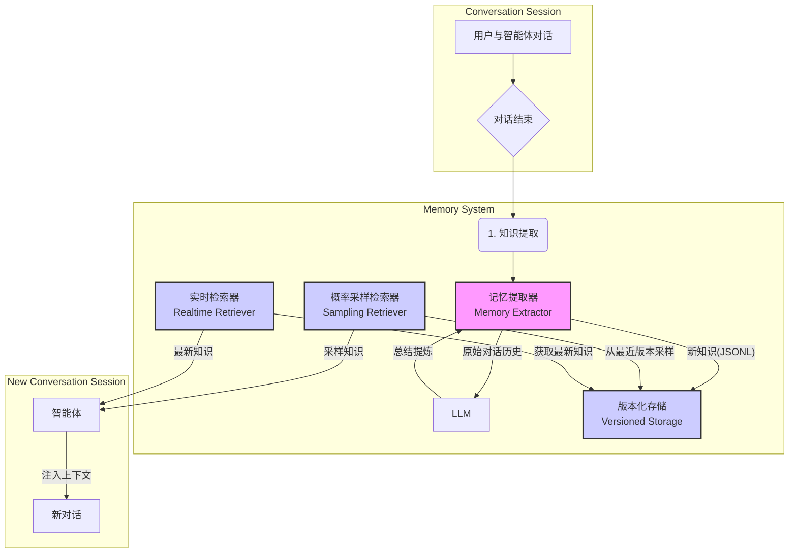

# 智能体长期记忆与知识压缩系统技术设计文档

## 1. 背景

当前的智能体（Agent）大多是无状态的，它们在单次对话中表现出色，但对话结束后通常会"忘记"所有交互信息。这种"失忆"特性极大地限制了智能体的能力，使其无法从过去的经验中学习、无法形成对世界和用户的个性化认知，也无法实现真正的自适应（Adaptive）和持续进化。

为了构建更高级的智能体，我们需要为其设计一个持久化记忆系统。该系统旨在模拟生物学习的过程，能够从海量的对话历史中自动总结、压缩和抽象出有价值的知识，并将其结构化地存储起来。这些知识将在后续的交互中被重新调用，作为上下文（Context）注入到智能体的"大脑"中，从而使其能够：

*   **记住**：长期记住关键信息、用户偏好和历史经验。
*   **理解**：构建关于世界、领域和用户的动态模型。
*   **学习**：从成功和失败的交互中总结方法论，不断优化自身行为。
*   **进化**：随着时间的推移，积累的知识越来越多，智能体也变得越来越"聪明"和"有经验"。

本项目旨在设计并实现这样一个记忆管理与压缩系统，为构建自适应学习智能体提供核心支撑。

## 2. 设计思路

系统设计的核心思路是**异步处理、结构化存储、持续整合**。

*   **异步处理 (Asynchronous Processing)**：记忆的总结和压缩是一个耗时过程，不应阻塞主对话流程。因此，我们采用异步的方式，在每次对话会话（Session）结束后，触发一个独立的任务来处理该次对话的记忆提取，确保用户交互的实时响应。

*   **大模型驱动的知识抽象 (LLM-Driven Knowledge Abstraction)**：利用大语言模型（LLM）强大的归纳和推理能力，对原始对话数据进行高级处理。我们不满足于简单存储对话流水，而是通过精心设计的 Prompt，引导 LLM 抽取出三个核心类型的结构化知识：**世界模型 (World Model)**、**经验知识 (Experiential Knowledge)** 和 **其他知识 (Other Knowledge)**。

*   **结构化与可量化 (Structured & Quantifiable)**：所有知识都以统一的 `JSONL` 格式存储。每个知识点是一个 JSON 对象，包含 `内容 (content)`、`类型 (type)` 和 `评分 (score)` 等关键字段。这种结构化方式便于后续的检索、过滤和管理。`score` 字段（0-100）由 LLM 评定其重要性，为知识的筛选和合并提供了量化依据。

*   **版本化与持续整合 (Versioning & Continuous Integration)**：知识库是动态演进的。系统会定期（如每天/每小时）为每个用户将新产生的增量知识与存量知识进行合并与精炼。这个过程同样可以借助 LLM 去重、修正矛盾、泛化新规律，最终形成一个更全面、更精炼的新版本知识库。版本化存储不仅记录了智能体的"成长轨迹"，也为问题追溯和系统回滚提供了保障。

*   **可拔插的存储层 (Pluggable Storage Layer)**：通过定义抽象存储类 `MemStorage`，将核心逻辑与底层存储实现解耦。初期我们可以快速实现一个基于文件系统的 `MemStorageFileSys`，未来也可以根据需要无缝扩展到数据库、向量数据库或其他存储系统，而无需改动上层业务逻辑。

*   **用户隔离与安全 (User Isolation & Security)**：每个用户拥有独立的记忆空间，确保用户间的知识完全隔离。基于 `user_id` 的存储分区机制，保证用户隐私安全，避免信息泄露。

## 3. 总体架构

整个系统由四个核心组件构成：**记忆提取器 (Memory Extractor)**、**知识合并器 (Knowledge Merger)**、**版本化存储 (Versioned Storage)** 和 **知识检索器 (Knowledge Retriever)**。



**处理流程说明:**

1.  **对话与触发**：用户与智能体的对话正常进行。当一个完整的对话会话（Session）结束后，系统会触发**记忆提取器**。
2.  **知识提取**：**记忆提取器**接收到该次会话的完整历史记录，调用 LLM 对其进行总结，生成结构化知识（JSONL 格式）。
3.  **直接存储**：提取的知识直接保存为新的版本，无需复杂的合并过程。
4.  **知识检索**：系统提供两种检索方式：
    - **实时检索**：从最新版本获取知识，确保信息的时效性
    - **概率采样检索**：从最近几个版本中基于分数进行加权随机采样，平衡重要性和多样性
5.  **上下文注入**：在对话开始时，将检索到的相关知识注入到智能体的上下文中，辅助其做出更精准、更个性化的回应。

## 4. 模块架构与接口设计

### 4.1. 核心数据结构

为了保证知识的结构化和一致性，我们定义标准的数据格式。首先是对话消息的格式，然后是知识点的格式。

#### 4.1.1. 对话消息格式

每条对话消息都包含角色信息和内容，这样LLM可以更好地理解上下文关系：

```python
from typing import List, Dict, Any, TypedDict, Literal
from datetime import datetime

# 对话消息的数据结构
class ConversationMessage(TypedDict):
    role: Literal["user", "assistant", "system"]  # 消息角色
    content: str  # 消息内容
    timestamp: str  # 时间戳，ISO格式
    user_id: str  # 用户ID，用于记忆隔离
    metadata: Dict[str, Any]  # 可选元数据，如工具调用、附件等
```

#### 4.1.2. 知识点格式

知识点是系统的核心数据结构，通过 `TypedDict` 来实现类型提示，增强代码的可读性和健壮性。每个知识点都包含以下核心字段：
- `content`: 知识点的具体内容，是一段简洁的文本摘要。
- `type`: 知识的预定义分类，包括 'WorldModel'、'ExperientialKnowledge' 或 'OtherKnowledge'。
- `score`: 由 LLM 评定的重要性分数（0-100），用于后续的筛选和排序。
- `metadata`: 溯源信息和其他元数据。

```python
# 知识点的数据结构
class KnowledgePoint(TypedDict):
    content: str
    type: Literal["WorldModel", "ExperientialKnowledge", "OtherKnowledge"]
    score: int  # 0-100
    user_id: str  # 归属用户ID，确保隔离
    metadata: Dict[str, Any]  # session_id, create_time, source等
```

### 4.2. 存储层 (`MemStorage`)

为了实现存储系统的可扩展性和可替换性，我们设计了一个抽象基类 `MemStorage`。它定义了所有存储实现（无论是基于文件系统、数据库还是对象存储）都必须遵循的统一接口。这种设计使得上层业务逻辑（如 `MemoryManager`）可以完全独立于具体的存储方式，未来更换存储后端将不会影响到核心业务代码。
该抽象类定义了知识的增、查等核心操作，支持版本化存储和概率采样检索。

```python
import abc

class MemStorage(abc.ABC):
    """Abstract base class for memory storage with user isolation."""

    @abc.abstractmethod
    def save_knowledge(self, user_id: str, version_id: str, knowledge_data: List[KnowledgePoint]):
        """Saves a new version of the knowledge base for a specific user."""
        raise NotImplementedError

    @abc.abstractmethod
    def load_knowledge(self, user_id: str, version_id: str = "latest", top_k: int = None) -> List[KnowledgePoint]:
        """
        Loads a specific version of the knowledge base for a specific user.
        
        :param user_id: User ID for memory isolation
        :param version_id: Version ID to load. "latest" for latest, None for probability sampling from recent versions
        :param top_k: Number of knowledge points to return when sampling (used when version_id is None)
        :return: List of knowledge points
        """
        raise NotImplementedError

    @abc.abstractmethod
    def get_latest_version_id(self, user_id: str) -> str:
        """Gets the ID of the latest version for a specific user."""
        raise NotImplementedError
    
    @abc.abstractmethod
    def get_recent_versions(self, user_id: str, count: int) -> List[str]:
        """Gets the IDs of the most recent versions for a specific user."""
        raise NotImplementedError
```

### 4.3. 记忆管理器 (`MemoryManager`)

`MemoryManager` 是整个记忆系统的核心控制器，也是系统对外的总入口。它封装了所有复杂的内部流程，如知识的提取、存储和检索。它复用全局配置中的LLM客户端，避免重复配置，通过依赖注入的方式接收一个 `MemStorage` 实例。
该类提供了三大核心功能：
- **异步提取 (`extract_knowledge_async`)**：处理单个对话，提取知识并直接保存为新版本。
- **概率采样检索 (`retrieve_knowledge_with_sampling`)**：从最近版本中基于分数进行加权随机采样。
- **实时检索 (`retrieve_relevant_knowledge`)**：根据查询，从最新知识库中获取相关信息以供使用。

该类的完整初始化方法已在配置管理部分定义，核心业务方法如下：

```python
# MemoryManager 的核心业务方法：

    def extract_knowledge_sync(self, user_id: str, messages: Messages, context, auto_merge: bool = True):
        """
        Synchronously extracts knowledge from a conversation and saves it as a new version.
        
        :param user_id: User ID for memory isolation
        :param messages: Conversation messages to extract knowledge from
        :param context: Context instance needed for LLMClient initialization
        :param auto_merge: Whether to automatically merge knowledge after extraction (deprecated)
        """
        # 1. 构建 Prompt
        # 2. 调用 self.llm_client 获取知识点 (JSONL 字符串)
        # 3. 解析和验证字符串为 List[KnowledgePoint]，并添加 user_id
        # 4. 直接保存为新版本: self.storage.save_knowledge(user_id, version_id, knowledge_data)
        # ... implementation details ...

    def retrieve_relevant_knowledge(self, user_id: str, query: str = None, top_k: Optional[int] = None) -> List[KnowledgePoint]:
        """
        Retrieves knowledge relevant to a given query for a specific user to be injected into context.
        
        :param user_id: The user whose knowledge should be retrieved
        :param query: Query string (not currently used in this implementation)
        :param top_k: Number of knowledge points to return
        """
        latest_knowledge = self.storage.load_knowledge(user_id, "latest", top_k=top_k)
        
        # Filter by minimum score threshold and sort by score
        filtered_points = [
            point for point in latest_knowledge 
            if point['score'] >= self.memory_config.min_score_threshold
        ]
        filtered_points.sort(key=lambda p: p['score'], reverse=True)
        return filtered_points[:top_k]

    def retrieve_knowledge_with_sampling(self, user_id: str, top_k: Optional[int] = None) -> List[KnowledgePoint]:
        """
        Retrieves knowledge using probability sampling from recent versions for a specific user.
        
        :param user_id: The user whose knowledge should be retrieved
        :param top_k: Number of knowledge points to return
        :return: Sampled knowledge points
        """
        # Use version_id=None to trigger probability sampling
        sampled_knowledge = self.storage.load_knowledge(user_id, version_id=None, top_k=top_k)
        return sampled_knowledge
```

### 4.4. 文件系统存储实现 (`MemStorageFileSys`)

这是 `MemStorage` 抽象类的具体实现，基于文件系统进行存储。它管理版本化的知识库文件，支持概率采样检索。

```python
import os
import json
import random
from datetime import datetime
from pathlib import Path

class MemStorageFileSys(MemStorage):
    """File system implementation of MemStorage with user isolation."""
    
    def __init__(self, base_path: str, memory_config=None):
        """
        Initialize the file system storage.
        
        :param base_path: Base directory path for storing knowledge data
        :param memory_config: Memory configuration for sampling parameters
        """
        self.base_path = Path(base_path)
        self.memory_config = memory_config
        
        # Create base directory if it doesn't exist
        self.base_path.mkdir(parents=True, exist_ok=True)
    
    def _get_user_paths(self, user_id: str):
        """Get user-specific paths for storage isolation."""
        sanitized_user_id = sanitize_user_id(user_id)
        user_dir = self.base_path / f"user_{sanitized_user_id}"
        versions_dir = user_dir / "versions"
        latest_file = user_dir / "latest.txt"
        
        # Create user directories if they don't exist
        try:
            versions_dir.mkdir(parents=True, exist_ok=True)
        except OSError as e:
            raise StorageError(f"Failed to create user directories for {user_id}: {e}")
        
        return user_dir, versions_dir, latest_file
    
    def save_knowledge(self, user_id: str, version_id: str, knowledge_data: List[KnowledgePoint]):
        """Save knowledge to a new version for a specific user."""
        try:
            _, versions_dir, latest_file = self._get_user_paths(user_id)
            
            version_dir = versions_dir / version_id
            version_dir.mkdir(exist_ok=True)
            
            knowledge_file = version_dir / "knowledge.jsonl"
            
            # Write knowledge data as JSONL
            with open(knowledge_file, 'w', encoding='utf-8') as f:
                for point in knowledge_data:
                    # Ensure user_id is consistent
                    point_with_user = dict(point)
                    point_with_user['user_id'] = user_id
                    f.write(json.dumps(point_with_user, ensure_ascii=False) + '\n')
            
            # Update latest version pointer
            with open(latest_file, 'w') as f:
                f.write(version_id)
                
        except (OSError, IOError) as e:
            raise StorageError(f"Failed to save knowledge for user {user_id}: {e}")
    
    def load_knowledge(self, user_id: str, version_id: Optional[str] = None, top_k: Optional[int] = None) -> List[KnowledgePoint]:
        """Load knowledge from a specific version for a specific user."""
        try:
            _, versions_dir, _ = self._get_user_paths(user_id)
            
            if version_id is None:
                # Probability sampling from recent versions
                return self._load_knowledge_with_sampling(user_id, top_k)
            
            if version_id == "latest":
                version_id = self.get_latest_version_id(user_id)
            
            return self._load_knowledge_from_version(user_id, version_id)
            
        except (OSError, IOError, json.JSONDecodeError) as e:
            raise StorageError(f"Failed to load knowledge for user {user_id}: {e}")
    
    def get_latest_version_id(self, user_id: str) -> str:
        """Get the latest version ID for a specific user."""
        try:
            _, _, latest_file = self._get_user_paths(user_id)
            
            if latest_file.exists():
                with open(latest_file, 'r') as f:
                    return f.read().strip()
            return ""
            
        except (OSError, IOError) as e:
            # Return empty string instead of raising error for non-existent users
            return ""
    
    def get_recent_versions(self, user_id: str, count: int) -> List[str]:
        """Get the IDs of the most recent versions for a specific user."""
        try:
            _, versions_dir, _ = self._get_user_paths(user_id)
            
            if not versions_dir.exists():
                return []
            
            # Get all version directories and sort by name (assuming timestamp format)
            version_dirs = [d.name for d in versions_dir.iterdir() if d.is_dir()]
            version_dirs.sort(reverse=True)  # Most recent first
            
            return version_dirs[:count]
            
        except (OSError, IOError) as e:
            return []
    
    def _load_knowledge_from_version(self, user_id: str, version_id: str) -> List[KnowledgePoint]:
        """Load knowledge from a specific version without any processing."""
        try:
            _, versions_dir, _ = self._get_user_paths(user_id)
            
            if not version_id:
                return []
                
            knowledge_file = versions_dir / version_id / "knowledge.jsonl"
            
            if not knowledge_file.exists():
                return []
            
            knowledge_data = []
            with open(knowledge_file, 'r', encoding='utf-8') as f:
                for line in f:
                    if line.strip():
                        point = json.loads(line)
                        # Verify user_id matches for security
                        if point.get('user_id') == user_id:
                            knowledge_data.append(point)
            
            return knowledge_data
            
        except (OSError, IOError, json.JSONDecodeError) as e:
            return []
    
    def _load_knowledge_with_sampling(self, user_id: str, top_k: Optional[int] = None) -> List[KnowledgePoint]:
        """Load knowledge from recent versions using probability sampling based on scores."""
        try:
            # Get default values from config or use fallbacks
            recent_count = getattr(self.memory_config, 'recent_versions_count', 5) if self.memory_config else 5
            default_top_k = getattr(self.memory_config, 'default_top_k', 5) if self.memory_config else 5
            min_score_threshold = getattr(self.memory_config, 'min_score_threshold', 20) if self.memory_config else 20
            
            if top_k is None:
                top_k = default_top_k
            
            # Get recent versions
            recent_versions = self.get_recent_versions(user_id, recent_count)
            if not recent_versions:
                return []
            
            # Collect all knowledge points from recent versions
            all_knowledge = []
            for version_id in recent_versions:
                version_knowledge = self._load_knowledge_from_version(user_id, version_id)
                all_knowledge.extend(version_knowledge)
            
            if not all_knowledge:
                return []
            
            # Filter by minimum score threshold
            filtered_knowledge = [
                point for point in all_knowledge 
                if point['score'] >= min_score_threshold
            ]
            
            if not filtered_knowledge:
                return []
            
            # If we have fewer points than requested, return all
            if len(filtered_knowledge) <= top_k:
                return filtered_knowledge
            
            # Perform weighted sampling based on scores
            return self._weighted_sample(filtered_knowledge, top_k)
            
        except Exception as e:
            # Fallback: return empty list on any error
            return []
    
    def _weighted_sample(self, knowledge_points: List[KnowledgePoint], top_k: int) -> List[KnowledgePoint]:
        """Perform weighted random sampling based on knowledge scores."""
        if not knowledge_points or top_k <= 0:
            return []
        
        # Create weights based on scores (ensure positive weights)
        weights = [max(point['score'], 1) for point in knowledge_points]
        total_weight = sum(weights)
        
        if total_weight == 0:
            # Fallback to uniform sampling if all scores are 0
            return random.sample(knowledge_points, min(top_k, len(knowledge_points)))
        
        # Perform weighted sampling without replacement
        sampled_points = []
        available_points = knowledge_points.copy()
        available_weights = weights.copy()
        
        for _ in range(min(top_k, len(available_points))):
            # Calculate cumulative weights
            cumulative_weights = []
            cumsum = 0
            for weight in available_weights:
                cumsum += weight
                cumulative_weights.append(cumsum)
            
            # Random selection
            rand_val = random.uniform(0, cumulative_weights[-1])
            selected_idx = 0
            for i, cum_weight in enumerate(cumulative_weights):
                if rand_val <= cum_weight:
                    selected_idx = i
                    break
            
            # Add selected point and remove from available
            sampled_points.append(available_points[selected_idx])
            available_points.pop(selected_idx)
            available_weights.pop(selected_idx)
        
        return sampled_points
```

**文件系统目录结构示例（用户隔离）**：
```
data/memory/
├── user_alice123/
│   ├── versions/
│   │   ├── 20231027100000/
│   │   │   └── knowledge.jsonl
│   │   └── 20231028120000/
│   │       └── knowledge.jsonl
│   └── latest.txt (内容: "20231028120000")
├── user_bob456/
│   ├── versions/
│   │   └── 20231027140000/
│   │       └── knowledge.jsonl
│   └── latest.txt (内容: "20231027140000")
└── user_charlie789/
    ├── versions/
    └── latest.txt
```

### 4.5. 错误处理和异常管理

系统需要健壮的错误处理机制来应对各种异常情况：

```python
class MemorySystemError(Exception):
    """Base exception for memory system errors."""
    pass

class LLMExtractionError(MemorySystemError):
    """Raised when LLM knowledge extraction fails."""
    pass

class StorageError(MemorySystemError):
    """Raised when storage operations fail."""
    pass

class KnowledgeValidationError(MemorySystemError):
    """Raised when knowledge data validation fails."""
    pass

def validate_knowledge_point(data: Dict[str, Any], expected_user_id: str = None) -> KnowledgePoint:
    """
    Validate and convert raw data to KnowledgePoint.
    
    :param data: Raw dictionary data
    :param expected_user_id: Expected user_id for validation (optional)
    :return: Validated KnowledgePoint
    :raises KnowledgeValidationError: If validation fails
    """
    required_fields = ['content', 'type', 'score', 'user_id']
    
    for field in required_fields:
        if field not in data:
            raise KnowledgeValidationError(f"Missing required field: {field}")
    
    if data['type'] not in ['WorldModel', 'ExperientialKnowledge', 'OtherKnowledge']:
        raise KnowledgeValidationError(f"Invalid knowledge type: {data['type']}")
    
    if not isinstance(data['score'], int) or not (0 <= data['score'] <= 100):
        raise KnowledgeValidationError(f"Score must be integer between 0-100: {data['score']}")
    
    if expected_user_id and data['user_id'] != expected_user_id:
        raise KnowledgeValidationError(f"User ID mismatch: expected {expected_user_id}, got {data['user_id']}")
    
    return {
        'content': str(data['content']),
        'type': data['type'],
        'score': int(data['score']),
        'user_id': str(data['user_id']),
        'metadata': data.get('metadata', {})
    }
```

### 4.6. 配置管理

系统的配置管理复用现有的 `GlobalConfig`，只添加记忆系统特有的配置项，保持简洁和一致性：

```python
from dataclasses import dataclass
from src.DolphinLanguageSDK.config.global_config import GlobalConfig

@dataclass
class MemoryConfig:
    """Configuration for the memory system."""
    
    # Storage settings
    storage_path: str = "data/memory/"  # 与项目数据目录保持一致
    
    # Knowledge extraction settings
    max_extraction_retries: int = 3
    extraction_timeout: int = 300  # seconds
    
    # Retrieval settings
    default_top_k: int = 5
    min_score_threshold: int = 20
    recent_versions_count: int = 5  # 概率采样时考虑的最近版本数量
    
    # Performance settings
    max_knowledge_points: int = 10000  # 合理的限制

class MemoryManager:
    """The main orchestrator for the memory system."""

    def __init__(self, global_config: GlobalConfig):
        """
        Initializes the MemoryManager.
        
        :param global_config: Global configuration instance, will create default if None.
        """
        self.global_config = global_config
        self.memory_config = global_config.memory_config
        
        # Initialize storage based on config
        self.storage = MemStorageFileSys(self.memory_config.storage_path, self.memory_config)
        
        # Initialize async knowledge extractor
        self.async_extractor = AsyncKnowledgeExtractor(self)
```

## 5. 概率采样检索策略详解

### 5.1. 设计思路

由于移除了复杂的知识合并机制，系统现在采用**概率采样检索**来平衡知识的新鲜度和重要性。这种策略从最近的几个版本中基于知识点的分数进行加权随机采样，既保证了重要知识的优先性，又避免了过度依赖单一版本。

### 5.2. 采样算法

系统采用基于分数的加权随机采样算法：

1. **版本范围确定**：从最近的 N 个版本中收集所有知识点（默认 N=5）
2. **分数过滤**：过滤掉分数低于阈值（默认 20）的知识点
3. **加权采样**：根据知识点的分数进行加权随机采样，分数越高被选中的概率越大
4. **无重复采样**：确保同一个知识点不会被重复选中

```python
def _weighted_sample(self, knowledge_points: List[KnowledgePoint], top_k: int) -> List[KnowledgePoint]:
    """Perform weighted random sampling based on knowledge scores."""
    if not knowledge_points or top_k <= 0:
        return []
    
    # Create weights based on scores (ensure positive weights)
    weights = [max(point['score'], 1) for point in knowledge_points]
    total_weight = sum(weights)
    
    if total_weight == 0:
        # Fallback to uniform sampling if all scores are 0
        return random.sample(knowledge_points, min(top_k, len(knowledge_points)))
    
    # Perform weighted sampling without replacement
    sampled_points = []
    available_points = knowledge_points.copy()
    available_weights = weights.copy()
    
    for _ in range(min(top_k, len(available_points))):
        # Calculate cumulative weights
        cumulative_weights = []
        cumsum = 0
        for weight in available_weights:
            cumsum += weight
            cumulative_weights.append(cumsum)
        
        # Random selection
        rand_val = random.uniform(0, cumulative_weights[-1])
        selected_idx = 0
        for i, cum_weight in enumerate(cumulative_weights):
            if rand_val <= cum_weight:
                selected_idx = i
                break
        
        # Add selected point and remove from available
        sampled_points.append(available_points[selected_idx])
        available_points.pop(selected_idx)
        available_weights.pop(selected_idx)
    
    return sampled_points
```

### 5.3. 优势分析

1. **平衡性**：既考虑知识的重要性（分数），又保持一定的随机性，避免知识库固化
2. **效率性**：无需复杂的合并计算，直接基于现有分数进行采样
3. **可配置性**：通过配置参数可以调整采样策略（版本数量、分数阈值、采样数量等）
4. **容错性**：即使某个版本的数据有问题，也不会影响整体检索效果

## 6. 性能优化考虑

### 6.1. 内存管理
- 大型知识库分页加载
- 使用生成器进行批量处理
- 定期清理过期缓存

### 6.2. 存储优化
- 知识点索引加速检索
- 压缩存储减少磁盘占用
- 并行处理提升采样效率

### 6.3. 检索优化
- 建立倒排索引支持快速关键词检索
- 预计算热点查询的结果
- 异步加载非关键知识

## 7. 部署与运维

*   **依赖**：系统复用现有的 `GlobalConfig` 和 LLM 服务，只需要额外的存储路径配置。
*   **部署方式**：
    1.  `MemoryManager` 及其相关类作为 DolphinLanguageSDK 的一部分，被主应用直接调用。
    2.  `extract_knowledge_sync` 的同步执行确保知识提取的实时性和可靠性。
    3.  `extract_knowledge_async` 的异步执行可以通过多种方式实现：
        *   简单的 `threading.Thread`
        *   使用 `Celery` 或 `Dramatiq` 等分布式任务队列
    4.  概率采样检索无需定时任务，在需要时实时计算。
*   **配置简化**：
    ```python
    # 在现有的全局配置基础上，只需添加少量记忆系统配置
    memory_config = MemoryConfig(
        storage_path="data/memory/",  # 存储路径
        default_top_k=5,              # 默认检索数量
        min_score_threshold=20,       # 最低分数阈值
        recent_versions_count=5       # 采样版本数量
    )
    
    # 初始化记忆系统
    storage = MemStorageFileSys(memory_config.storage_path, memory_config)
    memory_manager = MemoryManager(global_config)
    
    # 使用示例
    user_id = "alice123"  # 从用户会话中获取
    
    # 检索用户相关知识（最新版本）
    relevant_knowledge = memory_manager.retrieve_relevant_knowledge(
        user_id=user_id, 
        top_k=3
    )
    
    # 概率采样检索（从最近版本中采样）
    sampled_knowledge = memory_manager.retrieve_knowledge_with_sampling(
        user_id=user_id,
        top_k=5
    )
    
    # 同步提取新知识（对话结束时）
    conversation_history = [
        {"role": "user", "content": "我喜欢红色", "user_id": user_id, ...},
        {"role": "assistant", "content": "好的，我记住了", "user_id": user_id, ...}
    ]
    memory_manager.extract_knowledge_sync(user_id, conversation_history, context)
    ```
*   **监控**：记录关键操作的日志，如知识提取的成功与失败、采样检索的效果、生成的新知识版本号等。

## 8. 未来展望

*   **向量化检索**：将 `retrieve_relevant_knowledge` 的实现从关键词匹配升级为基于向量嵌入的语义搜索。在知识存储时，为每个知识点的 `content` 生成 embedding 并存入向量数据库（如 FAISS, Milvus, ChromaDB），检索时将查询文本也转换为向量，通过计算向量相似度来查找最相关的知识，极大地提升检索质量。
*   **智能知识合并**：重新引入智能合并机制，但采用更轻量级的设计。可以定期（如每周）对最近版本的知识进行去重和融合，生成一个更精炼的版本，而不是每次提取都合并。
*   **知识图谱构建**：在从对话中提取知识点后，可以进一步分析知识点之间的关系，并将其构建成知识图谱（Knowledge Graph）。这有助于进行更复杂的推理和洞察。
*   **主动遗忘机制**：引入知识的"遗忘"机制。对于长期未被访问、`score`较低或与新知识冲突的旧知识点，可以逐步降低其权重，甚至最终将其归档或移除，防止知识库无限膨胀，保持其高效和准确。
*   **多智能体知识共享**：在多智能体系统中，可以设计一套知识共享机制，允许不同的智能体共享和订阅特定领域的知识库，实现群体智能。

--- 