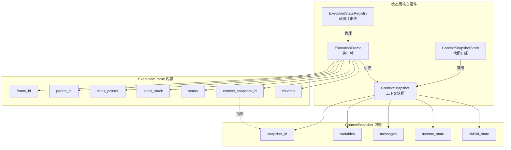
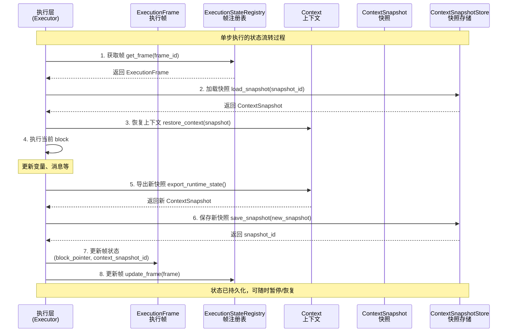
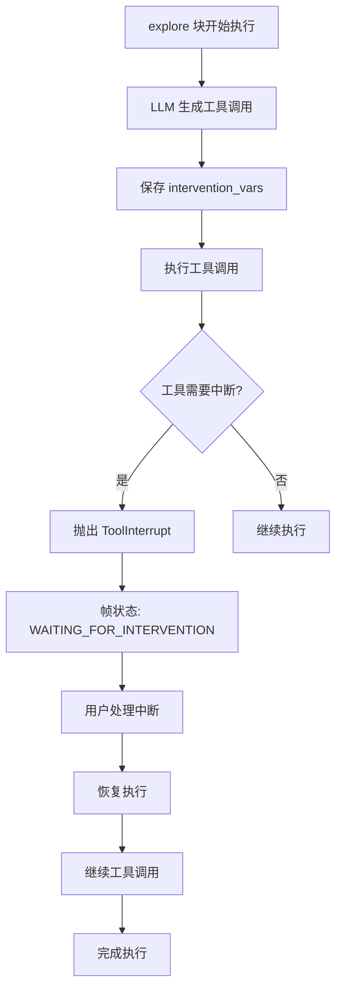

# Coroutine Execution Design

## 概述

协程执行系统为 Dolphin Language 添加了可暂停/恢复的执行能力，支持：
- 任意时刻的暂停与恢复
- 执行过程中的数据注入与交互
- 工具调用的中断处理（如权限请求）
- 完整的状态保存与恢复
- 与现有同步执行模式的兼容共存

## 目录结构

- [概述](#_1) - 功能介绍和目录导航
- [总体设计](#_3) - 架构思路与设计原则
- [分层架构设计](#_5) - 各层职责与接口
- [流程设计](#_8) - 启动、执行、暂停、恢复流程
- [最小核心数据结构](#_18) - ExecutionFrame、ContextSnapshot、ResumeHandle
- [执行流程设计](#_19) - 新旧接口共存策略
- [控制流支持](#_25) - if/for/parallel 状态管理
- [工具调用中断交互支持](#_26) - ⭐ 新增：Intervention 机制详解
- [使用指南](#_31) - 完整的使用说明和示例代码
- [故障排除与调试](#_43) - 常见问题解决和调试技巧
- [示例和参考](#_52) - 代码示例和 API 参考
- [事务性与崩溃恢复](#_54) - 可靠性保证
- [错误处理与恢复](#_55) - 异常处理策略
- [安全性设计](#resumehandle) - ResumeHandle 安全机制
- [并发控制](#_58) - 状态机与并发安全
- [测试要点](#_59) - 测试策略和要点

## 总体设计
- 目标是在现有 Agent → DolphinExecutor → Executor → CodeBlock → Skill 的执行链路上引入可暂停/恢复的 coroutine 能力。
- 核心构件包括 ExecutionFrame、ExecutionStateRegistry、ContextSnapshot、ContextSnapshotStore，以及继续承担观测职责的 RuntimeGraph。
- 执行器每推进一个最小步骤（block 或子块）都会刷新 ExecutionFrame 和 ContextSnapshot，从而随时可以暂停或恢复。
- DSL 语义保持不变，设计集中在执行状态管理和调度层，保留对旧接口的兼容性。

## 设计思路与折衷
- 状态分层：控制流状态放在 ExecutionFrame，运行时数据放在 ContextSnapshot，RuntimeGraph 仅保留观测信息，避免角色混淆。
- 快照策略：首版使用全量快照保证正确性和实现简单，后续可演进为增量快照；快照通过强类型数据类定义，便于版本演化。
- 调度模型：使用帧树调度嵌套 Agent 调用。并行 block 对应多个子帧，调度器按策略轮转或异步推进。
- 兼容性：新增能力与现有同步执行模式并行存在；RuntimeGraph 增加 frame_id/snapshot_id 关联即可。
- 性能取舍：优先保证语义正确和状态完整性，存储层先以文件/数据库实现，未来再优化缓存与缩减快照体积。

## 分层架构设计
- 调度层（Agent Runner）
  - 管理 ExecutionFrame 树生命期，提供 start/resume/pause/inspect/terminate 等 API。
  - 负责与外部系统交互，决定何时暂停、恢复或终止。
- 执行层（DolphinExecutor / Executor）
  - DolphinExecutor 暴露 `run_step(frame)` 与 `resume(frame)` 等接口。
  - Executor 将复杂 block 执行拆成可恢复的最小步骤，并维护局部状态对象（if/for/parallel）。
- 状态层
  - ExecutionFrame：包含 frame_id、parent_id、agent_id、block_pointer、block_stack、status 计数、context_snapshot_id、children。
  - ExecutionStateRegistry：集中存放帧树和索引，支持序列化与恢复。
  - ContextSnapshot：数据类，含 metadata（snapshot_id、frame_id、timestamp、schema_version）、VariableState、MessageState、RuntimeState、SkillkitState 等；提供 encode/decode。
  - ContextSnapshotStore：抽象存储接口，可对接文件系统、数据库或内存缓存，负责版本管理。

### 状态层组件关系图



### 状态层数据流图


- 上下文层
  - Context 新增 `export_runtime_state() -> ContextSnapshot` 与 `apply_runtime_state(snapshot)`。
  - RuntimeGraph 增加 `attach_frame(frame_id)` 等接口，以便关联观测事件与帧。
  - VariablePool、Messages、Skillkit、RuntimeGraph 均需支持深拷贝/序列化能力。
- 观测层
  - RuntimeGraph 继续承担嵌套观测，新增节点属性记录 frame_id、snapshot_id、事件类型（如 PAUSE/RESUME/STEP）。
  - 通过日志和监控追踪暂停/恢复/失败全过程。

## 流程设计
### 启动
1. Agent Runner 创建根 ExecutionFrame，并调用 Context 初始化得到初始 ContextSnapshot。
2. 将帧注册到 ExecutionStateRegistry，调用 `run_step(frame)` 开始执行。

### 单步执行
1. Executor 根据 `frame.block_pointer` 取下一个 block 或子步骤。
2. 执行 block，更新 Context（变量、消息、RuntimeGraph 事件等）。
3. Context 导出新的 ContextSnapshot，交由 ContextSnapshotStore 保存并返回 snapshot_id。
4. 更新 ExecutionFrame（block_pointer、block_stack、status、context_snapshot_id；如进入子 Agent 则创建子帧）。
5. 将更新后的帧写回 ExecutionStateRegistry。

### 暂停
1. Agent Runner 调用 pause(frame_id)。
2. ExecutionStateRegistry 返回目标帧及其子树当前状态，ContextSnapshotStore 已保存最新快照。
3. 返回包含 frame_id 和 snapshot_id 的 ResumeHandle，供外部存储或 UI 展示。

### 恢复
1. Agent Runner 调用 `resume(handle, updates?)`，其中 `updates` 为可选的数据字典，用于注入用户干预数据等。
2. 执行器加载 `handle` 指向的 `ContextSnapshot`，恢复上下文。
3. 若 `updates` 存在，则将其内容更新到上下文中。
4. 执行器基于更新后的上下文创建并保存一个**新快照**，并更新 `ExecutionFrame` 指向它。
5. 调度器调用 `run_step(frame)` 从新状态继续执行。

### 完成与回滚
- 子帧完成时，标记为 DONE 并通知父帧继续推进；若所有块完成，帧整体结束。
- 若需回滚，可选择旧的 context_snapshot_id 重新加载并恢复帧。

### 并行执行
- parallel block 为每个分支创建独立子帧，挂在同一父帧下。
- ExecutionStateRegistry 记录多个子帧；调度器可串行推进或使用任务队列并行推进。
- 所有子帧完成后，父帧合并结果并继续。

### 观测
- 每次快照生成或帧状态变化时，RuntimeGraph 增加观测节点（STEPPED、PAUSED、RESUMED 等）并附加 frame_id/snapshot_id。
- 运行历史通过 RuntimeGraph 与快照索引结合呈现。

## 兼容性设计原则
### 现有流程保持不变
```python
# 旧流程：完全兼容，无任何变化
dolphin_executor = DolphinExecutor()
async for result in dolphin_executor.run(content):
    yield result
```

### 新增 coroutine 流程
```python
# 新流程：新增接口，可暂停恢复
dolphin_executor = DolphinExecutor()
frame = await dolphin_executor.start_coroutine(content)  # 返回 ExecutionFrame
# 可以暂停
handle = await dolphin_executor.pause_coroutine(frame.frame_id)
# 可以恢复  
await dolphin_executor.resume_coroutine(handle)
```

## 最小核心数据结构

### FrameStatus 枚举
```python
class FrameStatus(Enum):
    RUNNING = "running"                          # 正在执行
    PAUSED = "paused"                             # 已暂停
    COMPLETED = "completed"                       # 已完成
    FAILED = "failed"                             # 执行失败
    WAITING_FOR_INTERVENTION = "waiting_for_intervention"  # 等待用户干预
    TERMINATED = "terminated"                     # 已终止
```

### 1. ExecutionFrame（执行帧）
```python
@dataclass
class ExecutionFrame:
    frame_id: str                    # 唯一ID
    parent_id: Optional[str]         # 父帧ID，用于嵌套
    agent_id: Optional[str]          # 关联的Agent ID
    block_pointer: int               # 当前执行到的block索引
    block_stack: List[dict]          # 控制流栈（if/for/parallel状态）
    status: FrameStatus              # RUNNING/PAUSED/COMPLETED/FAILED/WAITING_FOR_INTERVENTION/TERMINATED
    context_snapshot_id: str         # 当前上下文快照ID
    children: List[str]              # 子帧ID列表（parallel用）
    created_at: float                # 创建时间戳
    updated_at: float                # 更新时间戳
    original_content: str            # 原始Dolphin脚本内容
    error: Optional[Dict]            # 错误信息（失败或中断时的详细信息）
```

### 2. ContextSnapshot（上下文快照）
```python
@dataclass 
class ContextSnapshot:
    snapshot_id: str                 # 快照ID
    frame_id: str                    # 关联的帧ID  
    timestamp: float                 # 快照时间戳
    schema_version: str              # 快照格式版本
    variables: dict                  # 变量状态（从context.get_all_variables()）
    messages: List[dict]             # 消息历史
    runtime_state: dict              # 运行时状态（status等）
    skillkit_state: dict             # 技能状态
```

### 3. ResumeHandle（恢复句柄）
```python
@dataclass
class ResumeHandle:
    frame_id: str                    # 要恢复的帧ID
    snapshot_id: str                 # 要恢复的快照ID
    resume_token: str                # 恢复令牌（安全考虑）
```

## 执行流程设计

### 新旧流程共存策略
DolphinExecutor 保持原有 `run()` 方法不变，新增 coroutine 相关方法：

```python
class DolphinExecutor:
    # === 原有方法保持不变 ===
    async def run(self, content, **kwargs):
        # 现有逻辑完全不变
        ...
    
    # === 新增 coroutine 方法 ===
    async def start_coroutine(self, content, **kwargs) -> ExecutionFrame:
        """启动可暂停的执行"""
        
    async def step_coroutine(self, frame_id: str) -> bool:
        """执行一步，返回是否完成"""
        
    async def pause_coroutine(self, frame_id: str) -> ResumeHandle:
        """暂停执行"""
        
    async def resume_coroutine(self, handle: ResumeHandle, updates: Optional[dict] = None) -> ExecutionFrame:
        """恢复执行，并可选择性地注入更新数据到上下文中"""
```

### Executor 最小改造
Executor 新增 `step_mode` 支持：

```python
class Executor:
    def __init__(self, context: Context, step_mode: bool = False):
        self.step_mode = step_mode  # 新增：是否启用步进模式
        # 其他初始化保持不变
        
    async def run_step(self, blocks, block_pointer: int) -> Tuple[int, bool]:
        """新增：执行单个步骤，返回(新指针位置, 是否完成)"""
        if block_pointer >= len(blocks):
            return block_pointer, True
            
        # 执行当前block
        current_block = blocks[block_pointer]
        async for result in self.blocks_act([current_block]):
            yield result
            
        return block_pointer + 1, False
```

## 最小状态管理

### ExecutionStateRegistry（带并发控制）
```python
class ExecutionStateRegistry:
    """执行状态注册表 - 管理所有执行帧的生命周期，支持并发访问"""

    def __init__(self):
        self._frames: Dict[str, ExecutionFrame] = {}
        self._lock = threading.RLock()  # 可重入锁保证线程安全

    def register_frame(self, frame: ExecutionFrame) -> bool:
        """注册执行帧，返回是否成功"""
        with self._lock:
            if frame.frame_id in self._frames:
                return False
            self._frames[frame.frame_id] = frame
            return True

    def get_frame(self, frame_id: str) -> Optional[ExecutionFrame]:
        """获取执行帧"""
        with self._lock:
            return self._frames.get(frame_id)

    def update_frame(self, frame: ExecutionFrame) -> bool:
        """更新执行帧"""
        with self._lock:
            if frame.frame_id not in self._frames:
                return False
            frame.update_timestamp()
            self._frames[frame.frame_id] = frame
            return True

    def compare_and_swap(self, frame_id: str, expected_version: int, updates: Dict) -> Tuple[bool, Optional[ExecutionFrame]]:
        """乐观并发控制 - 比较并交换（CAS操作）"""
        # 支持并发安全的帧状态更新，避免竞态条件

    def get_child_frames(self, parent_id: str) -> List[ExecutionFrame]:
        """获取子执行帧列表"""
        # 支持帧树结构查询

    def get_frame_tree(self, root_id: str) -> Dict:
        """获取以指定帧为根的帧树"""
        # 返回完整的帧树结构用于调试和监控

    def get_stats(self) -> Dict:
        """获取注册表统计信息"""
        # 返回各状态帧的数量统计

    def cleanup_completed_frames(self, max_age_seconds: int = 3600) -> int:
        """清理已完成的旧执行帧"""
        # 自动清理长时间未使用的完成帧，释放内存
```

### ContextSnapshotStore（文件版）
```python
class ContextSnapshotStore:
    def __init__(self, base_path: str = "./data/snapshots"):
        self.base_path = base_path
        
    def save_snapshot(self, snapshot: ContextSnapshot) -> str:
        file_path = f"{self.base_path}/{snapshot.snapshot_id}.json"
        with open(file_path, 'w') as f:
            json.dump(asdict(snapshot), f)
        return snapshot.snapshot_id
        
    def load_snapshot(self, snapshot_id: str) -> ContextSnapshot:
        file_path = f"{self.base_path}/{snapshot_id}.json"
        with open(file_path, 'r') as f:
            data = json.load(f)
        return ContextSnapshot(**data)
```

## 核心执行逻辑

### 启动 Coroutine
```python
async def start_coroutine(self, content, **kwargs) -> ExecutionFrame:
    # 1. 创建执行帧
    frame = ExecutionFrame(
        frame_id=generate_uuid(),
        parent_id=None,
        block_pointer=0,
        block_stack=[],
        status=FrameStatus.RUNNING,
        context_snapshot_id="",
        children=[],
        created_at=time.time(),
        updated_at=time.time()
    )
    
    # 2. 初始化context并创建快照
    self._prepare_for_run(**kwargs)
    snapshot = self._create_snapshot(frame.frame_id)
    frame.context_snapshot_id = snapshot.snapshot_id
    
    # 3. 注册到状态管理器
    self.state_registry.register_frame(frame)
    self.snapshot_store.save_snapshot(snapshot)
    
    return frame
```

### 单步执行
```python
async def step_coroutine(self, frame_id: str) -> bool | ResumeHandle:
    # 1. 获取帧和恢复上下文
    frame = self.state_registry.get_frame(frame_id)
    snapshot = self.snapshot_store.load_snapshot(frame.context_snapshot_id)
    self._restore_context(snapshot)
    
    # 2. 获取解析好的blocks（缓存在frame中或重新解析）
    blocks = self._get_or_parse_blocks(frame)
    
    # 3. 执行单步
    executor = Executor(context=self.context, step_mode=True)
    # 可能在内部驱动工具时触发 ToolInterrupt
    new_pointer, is_complete = await executor.run_step(blocks, frame.block_pointer)
    
    # 4. 更新状态
    new_snapshot = self._create_snapshot(frame.frame_id)
    frame.block_pointer = new_pointer
    frame.context_snapshot_id = new_snapshot.snapshot_id
    if is_complete:
        frame.status = FrameStatus.COMPLETED
        
    # 5. 保存状态
    self.state_registry.update_frame(frame)
    self.snapshot_store.save_snapshot(new_snapshot)
    
    return is_complete  # 发生工具中断时会返回 ResumeHandle（见下文）
```

注意：实现中对 `ToolInterrupt` 进行捕获并将帧状态置为 `WAITING_FOR_INTERVENTION`，同时返回 `ResumeHandle` 而不是抛出异常。

### 暂停和恢复
```python
async def pause_coroutine(self, frame_id: str) -> ResumeHandle:
    frame = self.state_registry.get_frame(frame_id)
    frame.status = FrameStatus.PAUSED
    self.state_registry.update_frame(frame)
    
    return ResumeHandle(
        frame_id=frame_id,
        snapshot_id=frame.context_snapshot_id,
        resume_token=generate_token()
    )

async def resume_coroutine(self, handle: ResumeHandle, updates: Optional[dict] = None) -> ExecutionFrame:
    # 1. 获取帧
    frame = self.state_registry.get_frame(handle.frame_id)

    # 2. 如果有数据注入，则更新上下文并创建新快照
    if updates:
        # 2a. 从快照恢复当前上下文
        snapshot = self.snapshot_store.load_snapshot(handle.snapshot_id)
        self._restore_context(snapshot)

        # 2b. 应用 updates 数据 (例如：self.context.set_variable(key, value))
        for key, value in updates.items():
            self.context.set_variable(key, value)

        # 2c. 基于更新后的上下文创建新快照
        new_snapshot = self._create_snapshot(frame.frame_id)
        self.snapshot_store.save_snapshot(new_snapshot)

        # 2d. 更新帧以指向新快照
        frame.context_snapshot_id = new_snapshot.snapshot_id

    # 3. 将帧状态设为 RUNNING 并保存
    frame.status = FrameStatus.RUNNING
    self.state_registry.update_frame(frame)

    return frame
```

## 控制流支持

### if/for 状态保存
现有 Executor 中的 if/for 执行需要保存中间状态到 `block_stack`：

```python
# if block 状态
if_state = {
    "type": "if",
    "condition_index": 2,  # 当前执行到第几个条件
    "branch_entered": True  # 是否已进入某个分支
}

# for block 状态  
for_state = {
    "type": "for", 
    "var_name": "item",
    "loop_items": [...],
    "current_index": 3  # 当前循环索引
}
```

### parallel 支持
parallel block 创建多个子帧：

```python
async def handle_parallel_block(self, parent_frame, parallel_content):
    # 为每个并行分支创建子帧
    child_frames = []
    for i, branch_content in enumerate(parallel_branches):
        child_frame = ExecutionFrame(
            frame_id=generate_uuid(),
            parent_id=parent_frame.frame_id,
            block_pointer=0,
            # ... 其他字段
        )
        child_frames.append(child_frame)
    
    # 更新父帧的children列表
    parent_frame.children = [f.frame_id for f in child_frames]
    
    return child_frames
```

## 工具调用中断交互支持

### 核心机制

协程执行系统支持在 explore/judge/prompt 等块中触发工具调用的中断交互场景：

#### 1. Intervention 状态管理
- 当工具需要用户交互时：
  - 创建并保存新的上下文快照（`intervention_snapshot_id`）
  - 将 `ExecutionFrame.status` 置为 `WAITING_FOR_INTERVENTION`
  - 在 `frame.error` 中记录中断信息（`error_type=ToolInterrupt`、`tool_name`、`tool_args`、`at_block`、`intervention_snapshot_id`）
  - `step_coroutine` 返回一个 `ResumeHandle(frame_id, snapshot_id)`，供上层恢复

#### 2. ToolInterrupt 异常处理
```python
# ToolInterrupt 异常定义
class ToolInterrupt(Exception):
    def __init__(
        self,
        message="The tool was interrupted.",
        tool_name: str = None,
        tool_args: List[Dict] = None,
        *args,
        **kwargs,
    ):
        super().__init__(message, *args, **kwargs)
        self.tool_name = tool_name if tool_name else ""
        self.tool_args = tool_args if tool_args else []

# 工具调用中断示例
async def some_tool_function(param):
    if need_user_permission():
        # 抛出中断异常，触发暂停机制
        raise ToolInterrupt(
            message="需要用户权限确认",
            tool_name="some_tool",
            tool_args=[{"param": param}]
        )
    return result
```

#### 3. 中断工作流程


#### 4. 中断恢复处理
- 基于 `ResumeHandle.snapshot_id` 恢复上下文
- 可通过 `updates` 注入恢复所需的数据（如 `tool_result`）
- 清理 `frame.error` 并将帧状态置为 `RUNNING`，从中断点继续

### 实现特点

#### ✅ 完全支持的功能
1. **多层中断**：支持 explore 块内多个工具调用的连续中断
2. **状态一致性**：中断前后变量池和消息历史保持一致
3. **异步兼容**：所有中断处理都是异步的，与协程系统完美集成
4. **递归支持**：支持工具调用中的嵌套工具调用中断

#### ⚠️ 注意事项
1. **协程级集成**：需要在 `DolphinExecutor.step_coroutine()` 中捕获 `ToolInterrupt` 并转换为暂停状态
2. **快照持久化**：建议将 intervention 状态也保存到快照中以提高可靠性
3. **测试覆盖**：需要为中断恢复场景添加专门的测试案例

## 使用指南

### 基本使用

#### 1. 启动协程执行
```python
from DolphinLanguageSDK.dolphin_language import DolphinExecutor

executor = DolphinExecutor()

# Dolphin脚本
content = """
/assign/ result: "Hello World"
/assign/ count: 42
"""

# 启动协程执行
frame = await executor.start_coroutine(content)
print(f"Frame ID: {frame.frame_id}")
```

#### 2. 步进执行
```python
from DolphinLanguageSDK.coroutine.execution_frame import FrameStatus
from DolphinLanguageSDK.coroutine.resume_handle import ResumeHandle

# 逐步执行
while frame.status == FrameStatus.RUNNING:
    result = await executor.step_coroutine(frame.frame_id)

    # 处理工具中断
    if isinstance(result, ResumeHandle):
        # 发生工具中断，需要用户干预
        print(f"工具中断: {frame.error['message']}")
        # 处理中断逻辑...
        break

    # 处理正常完成
    if isinstance(result, dict) and result.get("completed"):
        print(f"执行完成，结果: {result['result']}")
        break

    # 更新frame状态
    frame = executor.state_registry.get_frame(frame.frame_id)

print(f"最终状态: {frame.status}")
```

#### 3. 暂停和恢复
```python
# 执行几步后暂停
await executor.step_coroutine(frame.frame_id)
await executor.step_coroutine(frame.frame_id)

# 暂停执行
handle = await executor.pause_coroutine(frame.frame_id)

# 稍后恢复执行
frame = await executor.resume_coroutine(handle)

# 继续步进执行...
```

#### 4. 数据注入与交互
```python
# 脚本中使用外部变量
content = """
$injected_data -> final_result
/explore/(tools=["_date"]) What time is it now? -> time_info
"""

frame = await executor.start_coroutine(content)

# 执行到需要数据注入的地方
await executor.step_coroutine(frame.frame_id)

# 暂停并注入数据
handle = await executor.pause_coroutine(frame.frame_id)

# 注入用户数据
updates = {"injected_data": "Data from user interaction!"}
frame = await executor.resume_coroutine(handle, updates=updates)

# 继续执行
while frame.status == FrameStatus.RUNNING:
    await executor.step_coroutine(frame.frame_id)
    frame = executor.state_registry.get_frame(frame.frame_id)
```

#### 5. 工具调用中断处理
```python
# 处理工具调用中断的脚本
content = """
/explore/(tools=["browser_snapshot"]) Take a screenshot of the webpage -> screenshot
"""

frame = await executor.start_coroutine(content)

while frame.status == FrameStatus.RUNNING:
    result = await executor.step_coroutine(frame.frame_id)
    frame = executor.state_registry.get_frame(frame.frame_id)

    if isinstance(result, ResumeHandle) or frame.status == FrameStatus.WAITING_FOR_INTERVENTION:
        # 处理用户交互（例如权限确认）
        print(f"工具中断: {frame.error['message']}")
        print(f"工具名称: {frame.error['tool_name']}")

        user_confirmation = await get_user_permission()
        if not user_confirmation:
            break  # 用户拒绝，终止执行

        # 注入确认数据并恢复
        updates = {"tool_result": {"confirmed": True}}
        frame = await executor.resume_coroutine(result, updates=updates)

        # 恢复后继续执行
        continue

    # 处理正常完成
    if isinstance(result, dict) and result.get("completed"):
        print(f"执行完成，结果: {result['result']}")
        break
```

### 高级功能

#### 状态检查与监控
```python
# 获取执行统计
stats = executor.state_registry.get_stats()
print(f"运行中的帧: {stats['running']}")
print(f"已暂停的帧: {stats['paused']}")
print(f"等待干预的帧: {stats['waiting_for_intervention']}")

# 获取快照信息
snapshot = executor.snapshot_store.load_snapshot(frame.context_snapshot_id)
print(f"变量数量: {len(snapshot.variables)}")
print(f"消息数量: {len(snapshot.messages)}")
```

#### 错误处理
```python
try:
    await executor.step_coroutine(frame.frame_id)
except Exception as e:
    frame = executor.state_registry.get_frame(frame.frame_id)
    if frame.status == FrameStatus.FAILED:
        print(f"执行失败: {frame.error['message']}")
        print(f"错误位置: block {frame.error['at_block']}")
```

#### 资源管理
```python
# 清理已完成的旧帧（1小时后）
cleaned = executor.state_registry.cleanup_completed_frames(max_age_seconds=3600)
print(f"清理了 {cleaned} 个旧帧")

# 清理过期的待定快照
cleaned = executor.snapshot_store.cleanup_pending_snapshots(max_age_seconds=3600)
print(f"清理了 {cleaned} 个过期快照")
```

### 兼容性

#### 新旧流程共存
```python
# 旧流程：完全兼容，无任何变化
dolphin_executor = DolphinExecutor()
async for result in dolphin_executor.run(content):
    yield result

# 新流程：新增接口，可暂停恢复
frame = await dolphin_executor.start_coroutine(content)
# 可以暂停
handle = await dolphin_executor.pause_coroutine(frame.frame_id)
# 可以恢复
await dolphin_executor.resume_coroutine(handle)
```

### 配置与最佳实践

#### 自定义存储配置
```python
from DolphinLanguageSDK.coroutine.context_snapshot_store import FileContextSnapshotStore, MemoryContextSnapshotStore

# 自定义快照存储位置
executor.snapshot_store = FileContextSnapshotStore("./custom/snapshots/path")

# 使用内存存储（测试用）
executor.snapshot_store = MemoryContextSnapshotStore()
```

#### 最佳实践
1. **定期清理**：定期清理已完成的帧和过期快照以释放存储空间
2. **错误处理**：总是检查 frame 状态和错误信息
3. **资源管理**：在长时间运行的应用中监控 frame 和快照数量
4. **安全性**：保护 ResumeHandle，防止未授权访问
5. **性能优化**：对于大量变量的场景，考虑快照大小优化

#### 限制和注意事项
1. **并发**：同一 frame 同时只能有一个操作进行
2. **存储**：快照使用 JSON 格式，大对象会增加存储成本
3. **兼容性**：复杂对象的序列化可能有限制
4. **性能**：每步执行都会创建新快照，大型脚本要注意性能

这个设计确保了：
1. **最小化**：只有4个核心数据结构，逻辑简单清晰
2. **兼容性**：现有代码完全不受影响
3. **渐进式**：可以分阶段实现，每个阶段都有实际价值
4. **实用性**：专注于暂停/恢复核心需求，避免过度设计
5. **交互性**：完整支持工具调用中断和用户交互场景

## 故障排除与调试

### 常见问题

#### 1. Frame not found 错误
**问题**：调用 `step_coroutine()` 或 `pause_coroutine()` 时提示找不到 frame

**解决方案**：
- 检查 `frame_id` 是否正确
- 检查 frame 是否已被清理（`cleanup_completed_frames()`）
- 确认 frame 状态是否允许当前操作

#### 2. Snapshot not found 错误
**问题**：恢复执行时找不到快照

**解决方案**：
- 检查快照存储路径是否正确
- 确认快照文件是否存在且未损坏
- 检查是否使用了正确的 `ContextSnapshotStore` 实现

#### 3. 序列化错误
**问题**：保存快照时出现序列化错误

**解决方案**：
- 检查变量中是否包含不可序列化的对象（如函数、文件句柄等）
- 清理或替换不可序列化的对象
- 考虑实现自定义序列化逻辑

#### 4. ToolInterrupt 处理不当
**问题**：工具调用中断后无法正确恢复

**解决方案**：
- 确认工具正确抛出 `ToolInterrupt` 异常
- 检查 `intervention_explore_block_vars` 是否正确保存
- 验证恢复时 `tool` 变量是否存在且格式正确

#### 5. 性能问题
**问题**：大型脚本执行缓慢，快照文件过大

**解决方案**：
- 定期清理不需要的变量
- 使用 `MemoryContextSnapshotStore` 进行测试
- 考虑实现增量快照（后续版本）
- 监控快照大小并优化变量存储

### 调试技巧

#### 检查执行状态
```python
# 查看 frame 详细信息
frame_dict = frame.to_dict()
print(f"Frame 详情: {frame_dict}")

# 查看快照内容
snapshot = executor.snapshot_store.load_snapshot(frame.context_snapshot_id)
print(f"变量列表: {list(snapshot.variables.keys())}")
print(f"消息数量: {len(snapshot.messages)}")

# 查看快照大小
import json
snapshot_size = len(json.dumps(snapshot.to_dict()))
print(f"快照大小: {snapshot_size} bytes")
```

#### 监控系统状态
```python
# 查看执行统计
stats = executor.state_registry.get_stats()
print(f"系统统计: {stats}")

# 查看存储统计
if hasattr(executor.snapshot_store, 'get_stats'):
    store_stats = executor.snapshot_store.get_stats()
    print(f"存储统计: {store_stats}")
```

#### 日志和跟踪
```python
import logging

# 启用调试日志
logging.getLogger('DolphinLanguageSDK.coroutine').setLevel(logging.DEBUG)

# 追踪执行流程
frame = await executor.start_coroutine(content)
print(f"Started frame: {frame.frame_id}")

while frame.status == FrameStatus.RUNNING:
    print(f"Step {frame.block_pointer}: {frame.status}")
    await executor.step_coroutine(frame.frame_id)
    frame = executor.state_registry.get_frame(frame.frame_id)
```

### 测试建议

#### 单元测试
```python
# 测试基本功能
async def test_basic_coroutine():
    executor = DolphinExecutor()
    frame = await executor.start_coroutine('42 -> result')

    assert frame.status == FrameStatus.RUNNING

    await executor.step_coroutine(frame.frame_id)
    frame = executor.state_registry.get_frame(frame.frame_id)

    assert frame.status == FrameStatus.COMPLETED

# 测试中断恢复
async def test_tool_interrupt():
    content = '/explore/(tools=["test_tool"]) Test prompt -> result'

    executor = DolphinExecutor()
    frame = await executor.start_coroutine(content)

    try:
        while frame.status == FrameStatus.RUNNING:
            await executor.step_coroutine(frame.frame_id)
            frame = executor.state_registry.get_frame(frame.frame_id)
    except ToolInterrupt:
        # 验证中断状态正确保存
        vars = executor.context.get_all_variables()
        assert 'intervention_explore_block_vars' in vars
        assert 'tool' in vars
```

#### 压力测试
```python
# 测试大量快照
async def test_performance():
    executor = DolphinExecutor()
    frame = await executor.start_coroutine(large_script)

    start_time = time.time()
    step_count = 0

    while frame.status == FrameStatus.RUNNING:
        await executor.step_coroutine(frame.frame_id)
        frame = executor.state_registry.get_frame(frame.frame_id)
        step_count += 1

        if step_count % 100 == 0:
            elapsed = time.time() - start_time
            print(f"Executed {step_count} steps in {elapsed:.2f}s")
```

## 示例和参考

### 完整示例代码
查看以下文件获取完整示例：
- `examples/coroutine_example.py`: 基本使用示例
- `tests/unittest/coroutine/test_coroutine_execution.py`: 功能测试
- `experiments/design/*/dolphins/*.dph`: 实际 Dolphin 脚本示例

### API 参考
- `DolphinExecutor`: 主要执行器类
- `ExecutionFrame`: 执行帧数据结构
- `ContextSnapshot`: 上下文快照数据结构
- `ResumeHandle`: 恢复句柄数据结构
- `FrameStatus`: 执行状态枚举

## 事务性与崩溃恢复（最小实现）

- 不变式：
  - ExecutionFrame.contextSnapshotId 仅指向“已提交”快照。
  - 每个 step 使用 stepId 幂等；重复提交不改变最终状态。
  - 帧更新与快照落盘具备“原子或等价可恢复”的提交序列。
- 最小实现（文件/JSON）：
  - 快照先以 pending 形态落盘，提交成功后原子重命名为最终文件名。
  - ExecutionFrame 增加 version（乐观并发）与 lastStepId（幂等检测）。
  - Registry 提供 compareAndSwap（CAS）。
- 提交序列（示意）：

```python
# BEGIN: write journal (optional minimal WAL)
journal.append({"stepId": stepId, "state": "BEGIN"})  # write-ahead

# 1) write pending snapshot
store.savePendingSnapshot(newSnapshot)  # write *.pending.json

# 2) CAS update frame
registry.compareAndSwap(
    frameId,
    expectedVersion=frame.version,
    update={
        "contextSnapshotId": newSnapshot.snapshotId,
        "version": frame.version + 1,
        "lastStepId": stepId,
    },
)

# 3) finalize snapshot (atomic rename)
store.finalizeSnapshot(newSnapshot.snapshotId)  # rename pending -> final

# COMMIT
journal.append({"stepId": stepId, "state": "COMMIT"})
```

- 崩溃恢复：
  - 仅有 BEGIN：清理对应的 pending 文件，保留旧指针。
  - 有 COMMIT 但快照未 finalize：补做 finalize；若帧未更新则依据 journal 修复。

### Runtime Graph 非持久化与重建策略

Runtime Graph（运行时图谱）作为观测层用于呈现 Agent→Block→Progress→Stage 的可视化结构与统计，并不作为强一致的持久化状态：

- 非持久化特性：
  - 快照（ContextSnapshot）中仅包含变量、消息与必要的运行时元数据，不包含 Runtime Graph 的树结构。
  - 发生崩溃或进程重启后，基于快照可以完整恢复“执行语义所需”的上下文，但图谱仅在新一轮执行时按需重建。

- 重建策略（推荐）：
  - 懒重建：在恢复后的后续 step/pause/resume/执行过程中，由各 Block 的记录器（Recorder）持续将新的 Stage 注入 Runtime Graph，前置已有阶段无需强制回放。
  - 最小对齐：若需要在恢复后立即呈现历史阶段，可基于上下文中的 `_progress` 列表（若有保存）对图谱做最小重建，将历史阶段以只读形式挂载到 Progress 节点下。
  - 观测优先：图谱旨在辅助观测与调试，不影响执行正确性。对需要“可复现观测”的场景，建议在应用层保存必要的执行轨迹并在 UI 层做拼接展示。

- 取舍说明：
  - 将图谱排除在快照之外，避免快照体积膨胀与序列化复杂度，保持恢复路径轻量且专注于“可继续执行”。
  - 对需要严格审计的环境，可将图谱事件（如 Stage 变更）另行写入审计日志或事件流，独立于执行快照。

## 错误处理与恢复（最小）

### 异常分类处理

协程系统对不同类型的异常采用分类处理策略：

#### 1. ToolInterrupt（工具中断）
- **处理方式**：转换为 `WAITING_FOR_INTERVENTION` 状态，不抛出异常
- **状态保存**：创建 intervention 快照，记录中断信息到 `frame.error`
- **返回机制**：返回 `ResumeHandle`，供外部处理中断逻辑
- **恢复方式**：通过 `resume_coroutine` 注入恢复数据后继续执行

#### 2. 其他执行异常
- **处理方式**：标记为 `FAILED` 状态，抛出异常终止执行
- **状态保存**：创建 error 快照，记录完整错误信息
- **不可恢复**：失败状态的帧无法自动恢复

### 错误信息结构
```python
frame.error = {
    # ToolInterrupt 错误
    "error_type": "ToolInterrupt",           # 错误类型
    "message": str(e),                       # 错误消息
    "tool_name": getattr(e, 'tool_name', ''), # 工具名称
    "tool_args": getattr(e, 'tool_args', []), # 工具参数
    "at_block": frame.block_pointer,         # 发生位置
    "intervention_snapshot_id": snapshot_id, # 中断快照ID

    # 其他执行错误
    "error_type": type(e).__name__,          # 异常类型
    "message": str(e),                       # 错误消息
    "stack": traceback.format_exc(),         # 完整堆栈
    "at_block": frame.block_pointer,         # 发生位置
    "error_snapshot_id": snapshot_id,        # 错误快照ID
}
```

### 并行传播策略（SupervisorPolicy）
- oneForOne：仅影响出错子帧
- allForOne：任一子帧失败使父帧失败或取消其它子帧
- alwaysContinue（默认）：记录错误，其他分支继续，父帧汇总

### 重试策略（RetryPolicy）
{maxRetries, backoff, retryOn}，默认关闭

## ResumeHandle 安全性（最小）

- 令牌形态：
  - 推荐 JWT（签名算法 ES256/EdDSA），包含：frameId, snapshotId, frameVersion, sub(userId), scope("dolphin:resume"), exp, jti, aud。
  - 或使用不透明随机 tokenId，并在服务端存储映射及吊销状态（更简单）。
- 校验要求：
  - 验证签名/未过期/受众/作用域/拥有者，检查 jti 未被吊销，校验 frameVersion 未回退且 frame.status 允许恢复（PAUSED/RUNNING）。
  - 建议短 TTL、单次或限次使用，并记录审计日志。

## 并发控制与状态机（最小）

- 每帧短锁：对同一 frameId 的提交临界区加短时锁（单进程 asyncio.Lock / 跨进程文件锁 / 分布式锁），不包裹耗时执行，仅覆盖“CAS + finalize”。
- 乐观并发：所有 step/pause/resume 基于 frame.version 的 compareAndSwap；不匹配返回冲突（可映射为 409）。
- 协作式暂停：pause 将 desiredStatus=PAUSING 写入，当前 step 提交后转换为 PAUSED；处于临界区时等待提交完成。
- 非法转移：如 COMPLETED 上 resume 直接拒绝（409 语义）。
- 幂等：对外接口支持 idempotencyKey 缓存结果，避免重放造成竞态。

## 测试要点（最小）

- 崩溃点注入：
  - 在 savePendingSnapshot 之后、CAS 之前；CAS 之后、finalize 之前；finalize 之后的随机点。
- 并行失败组合：
  - 验证 oneForOne / allForOne / alwaysContinue 下父子帧与兄弟帧的状态。
- 令牌安全：
  - 重放、越权、过期、吊销路径与审计。
- 并发压测：
  - 同 frame 多个 step/pause/resume 并发请求的顺序一致性与最终一致性。
