# Skill Results 模块类图

## 概述

Skill Results 模块提供了工具执行结果的缓存、策略处理和引用管理功能。该模块采用策略模式和工厂模式，支持多种缓存后端和处理策略。

## 类图结构

```mermaid
classDiagram
    %% 核心接口和抽象类 %%
    class CacheBackend {
        <<abstract>>
        +store(entry: CacheEntry) bool
        +get(reference_id: str) CacheEntry
        +delete(reference_id: str) bool
        +cleanup(max_age_hours: int) int
        +exists(reference_id: str) bool
        +get_stats() Dict[str, Any]
    }
    
    class BaseStrategy {
        <<abstract>>
        +category: str
        +get_category() str
        +supports(category: str) bool
        +process(result_reference: ResultReference, **kwargs) Any
    }
    
    %% 缓存相关类 %%
    class CacheEntry {
        +reference_id: str
        +full_result: Any
        +metadata: Dict[str, Any]
        +created_at: datetime
        +tool_name: str
        +size: int
        +ttl: Optional[int]
        +is_expired() bool
        +to_dict() Dict[str, Any]
        +from_dict(data: Dict[str, Any]) CacheEntry
    }
    
    class MemoryCacheBackend {
        -max_size: int
        -cache: Dict[str, CacheEntry]
        -access_times: Dict[str, datetime]
        +store(entry: CacheEntry) bool
        +get(reference_id: str) CacheEntry
        +delete(reference_id: str) bool
        +cleanup(max_age_hours: int) int
        +exists(reference_id: str) bool
        +get_stats() Dict[str, Any]
        -_evict_oldest()
    }
    
    class FileCacheBackend {
        -cache_dir: str
        -max_file_size: int
        +store(entry: CacheEntry) bool
        +get(reference_id: str) CacheEntry
        +delete(reference_id: str) bool
        +cleanup(max_age_hours: int) int
        +exists(reference_id: str) bool
        +get_stats() Dict[str, Any]
        -_ensure_cache_dir()
        -_get_file_path(reference_id: str) str
    }
    
    class DatabaseCacheBackend {
        -db_path: str
        +store(entry: CacheEntry) bool
        +get(reference_id: str) CacheEntry
        +delete(reference_id: str) bool
        +cleanup(max_age_hours: int) int
        +exists(reference_id: str) bool
        +get_stats() Dict[str, Any]
        -_init_database()
    }
    
    %% 策略相关类 %%
    class StrategyRegistry {
        -_strategies: Dict[str, Dict[str, BaseStrategy]]
        +register(name: str, strategy: BaseStrategy, category: str) bool
        +get(name: str, category: str) BaseStrategy
        +list_by_category(category: str) List[str]
        +categories() List[str]
        +unregister(name: str, category: str) bool
        +clear(category: str) int
        +get_stats() dict
        -_register_default_strategies()
        -_parse_category_name(name: str, category: str) Tuple[str, str]
    }
    
    class DefaultLLMStrategy {
        +category: str = "llm"
        +process(result_reference: ResultReference, **kwargs) str
    }
    
    class SummaryLLMStrategy {
        +category: str = "llm"
        +process(result_reference: ResultReference, **kwargs) str
        -_convert_to_string(data: Any) str
        -_generate_summary(text: str, max_chars: int) str
    }
    
    class TruncateLLMStrategy {
        +category: str = "llm"
        +process(result_reference: ResultReference, **kwargs) str
        -_convert_to_string(data: Any) str
    }
    
    class DefaultAppStrategy {
        +category: str = "app"
        +process(result_reference: ResultReference, **kwargs) Dict[str, Any]
    }
    
    class PaginationAppStrategy {
        +category: str = "app"
        +process(result_reference: ResultReference, **kwargs) Dict[str, Any]
        -_paginate_list(data: List[Any], page: int, page_size: int, metadata: Dict[str, Any], reference_id: str) Dict[str, Any]
        -_paginate_dict(data: Dict[str, Any], page: int, page_size: int, metadata: Dict[str, Any], reference_id: str) Dict[str, Any]
    }
    
    class PreviewAppStrategy {
        +category: str = "app"
        +process(result_reference: ResultReference, **kwargs) Dict[str, Any]
        -_generate_preview(data: Any, max_size: int, max_items: int) Any
        -_is_truncated(original: Any, preview: Any, max_size: int) bool
        -_truncate_preview(data: Any, max_size: int) str
    }
    
    %% 核心处理类 %%
    class ResultReference {
        -reference_id: str
        -cache_backend: CacheBackend
        -strategy_registry: StrategyRegistry
        -_cached_entry: Optional[CacheEntry]
        +get_full_result() Any
        +get_metadata() Dict[str, Any]
        +get_for_category(category: str, strategy_name: str, **kwargs) Any
        +get(strategy: str, **kwargs) Any
        +exists() bool
        +get_info() Dict[str, Any]
        +delete() bool
        -_parse_category_name(name: str) Tuple[Optional[str], str]
    }
    
    class ResultProcessor {
        -cache_backend: CacheBackend
        -strategy_registry: StrategyRegistry
        +process_result(tool_name: str, result: Any, metadata: Dict[str, Any]) ResultReference
        +get_result_reference(reference_id: str) ResultReference
        +delete_result(reference_id: str) bool
        +cleanup_expired(max_age_hours: int) int
        +get_stats() Dict[str, Any]
    }
    
    class SkillkitHook {
        -_processor: ResultProcessor
        +on_tool_after_execute(tool_name: str, result: Any, metadata: Dict[str, Any]) ResultReference
        +on_before_reply_app(reference_id: str, strategy_name: str, **kwargs) Dict[str, Any]
        +on_before_send_to_llm(reference_id: str, strategy_name: str, **kwargs) str
        +on_session_end(cleanup_hours: int) int
        +process_result(tool_name: str, result: Any, metadata: Dict[str, Any]) ResultReference
        +get_for_llm(reference_id: str, strategy_name: str, **kwargs) str
        +get_for_app(reference_id: str, strategy_name: str, **kwargs) Dict[str, Any]
        +get_result_reference(reference_id: str) ResultReference
        +delete_result(reference_id: str) bool
        +cleanup_expired(max_age_hours: int) int
        +get_stats() Dict[str, Any]
    }
    
    %% 继承关系 %%
    CacheBackend <|-- MemoryCacheBackend
    CacheBackend <|-- FileCacheBackend
    CacheBackend <|-- DatabaseCacheBackend
    
    BaseStrategy <|-- DefaultLLMStrategy
    BaseStrategy <|-- SummaryLLMStrategy
    BaseStrategy <|-- TruncateLLMStrategy
    BaseStrategy <|-- DefaultAppStrategy
    BaseStrategy <|-- PaginationAppStrategy
    BaseStrategy <|-- PreviewAppStrategy
    
    %% 依赖关系 %%
    MemoryCacheBackend --> CacheEntry
    FileCacheBackend --> CacheEntry
    DatabaseCacheBackend --> CacheEntry
    
    StrategyRegistry --> BaseStrategy
    
    ResultReference --> CacheBackend
    ResultReference --> StrategyRegistry
    
    ResultProcessor --> CacheBackend
    ResultProcessor --> StrategyRegistry
    ResultProcessor --> ResultReference
    
    SkillkitHook --> ResultProcessor
    
    DefaultLLMStrategy --> ResultReference
    SummaryLLMStrategy --> ResultReference
    TruncateLLMStrategy --> ResultReference
    DefaultAppStrategy --> ResultReference
    PaginationAppStrategy --> ResultReference
    PreviewAppStrategy --> ResultReference

```

## 类说明

### 1. 缓存相关类

#### CacheEntry
表示缓存条目，包含完整的执行结果和元数据。

#### CacheBackend (抽象类)
定义缓存后端的接口，所有具体缓存实现都继承自此类。

#### MemoryCacheBackend
内存缓存实现，适用于小数据量和高性能要求的场景。

#### FileCacheBackend
文件缓存实现，将结果序列化存储到文件中，支持持久化。

#### DatabaseCacheBackend
数据库缓存实现，使用SQLite存储结果，支持复杂查询和管理。

### 2. 策略相关类

#### BaseStrategy (抽象类)
定义策略的接口，所有具体策略实现都继承自此类。

#### LLM策略类
- `DefaultLLMStrategy`: 默认LLM策略，返回结果的字符串表示
- `SummaryLLMStrategy`: 摘要策略，生成结果摘要
- `TruncateLLMStrategy`: 截断策略，截断过长的结果

#### APP策略类
- `DefaultAppStrategy`: 默认APP策略，返回完整结果
- `PaginationAppStrategy`: 分页策略，支持结果分页显示
- `PreviewAppStrategy`: 预览策略，生成结果预览

#### StrategyRegistry
策略注册器，管理所有策略的注册和获取。

### 3. 核心处理类

#### ResultReference
结果引用类，提供对缓存结果的引用访问，支持根据不同策略获取处理后的结果。

#### ResultProcessor
结果处理器，负责处理工具执行结果，包括缓存、引用管理和策略应用。

#### SkillkitHook
面向SkillKit的结果处理钩子，提供与技能执行生命周期对接的接口。

## 设计模式

1. **策略模式**: 通过BaseStrategy和各种具体策略实现，支持根据不同场景处理结果
2. **工厂模式**: StrategyRegistry作为策略工厂，管理策略的创建和获取
3. **单例模式**: 各种缓存后端可以作为单例使用
4. **装饰器模式**: SkillkitHook为SkillKit提供装饰性的结果处理功能

## 使用流程

1. Skill执行完成后，通过SkillkitHook.process_result()处理结果
2. ResultProcessor将结果存储到指定的缓存后端
3. 返回ResultReference，用于后续的结果访问
4. 根据使用场景（前端展示或LLM输入），通过ResultReference.get_for_category()获取处理后的结果
5. StrategyRegistry根据策略名称和分类找到对应的策略进行处理